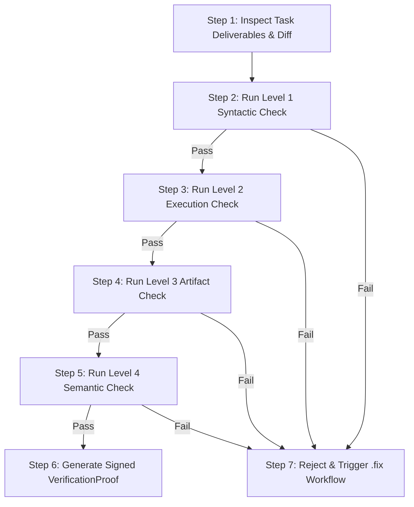

# Workflow: .audit (Code & Verification Evidence Audit)

## 1. Objective
Perform independent, objective code reviews and execute the 4-Level Evidence Verification Protocol on completed tasks, ensuring that deliverables strictly meet acceptance criteria and produce tamper-resistant cryptographic proofs.

## 2. Participating Agents
- **Auditor Agent**: Lead verification auditor.
- **Architect Agent**: Code quality and architectural compliance reviewer.

## 3. Step-by-Step Execution Protocol

### Step 1: Inspect Task Deliverables & Diff
1. Fetch task output metadata, generated files, and GCS artifact URIs.
2. Review git diff for style, readability, missing types, and anti-patterns.

### Step 2: Level 1 (Syntactic Verification)
1. Verify exit code == 0, valid JSON/schema output, no unhandled runtime exceptions.

### Step 3: Level 2 (Execution Verification)
1. Assert expected output logs, regex patterns, or live HTTP status codes.

### Step 4: Level 3 (Artifact Verification)
1. Confirm artifact existence in GCS with non-zero bytes.
2. Calculate and verify SHA-256 hash match.

### Step 5: Level 4 (Semantic & Integration Verification)
1. Verify passing automated test suite and independent LLM evaluation against acceptance criteria.

### Step 6: Generate Signed VerificationProof
1. Compile `VerificationProof` object.
2. Generate HMAC-SHA256 signature and commit proof to Firestore `/missions/{id}/proofs/{proofId}`.
3. Mark task status as `VERIFIED`.

## 4. Exit Criteria & Deliverables
- Signed `VerificationProof` document in Firestore.
- Task status updated to `VERIFIED` and downstream dependencies unlocked.
