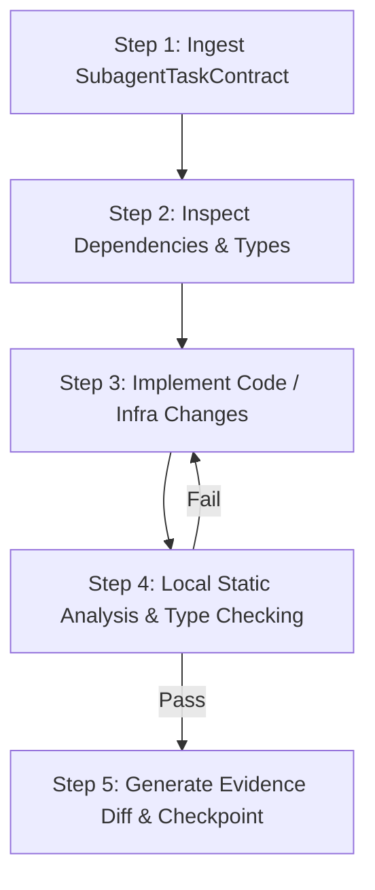

# Workflow: .build (Implementation & Construction)

## 1. Objective
Execute approved implementation tasks across backend services, Google ADK subagent modules, Next.js PWA frontend components, and Terraform cloud infrastructure, adhering strictly to 100% typing, clean code formatting, and modular separation.

## 2. Participating Agents
- **Coder Agent**: Writes Python and TypeScript code.
- **DevOps Agent**: Authors Terraform scripts, Dockerfiles, and Cloud Run configs.
- **Architect Agent**: Reviews interface alignment against `/docs/`.

## 3. Step-by-Step Execution Protocol

### Step 1: Ingest SubagentTaskContract
1. Extract task inputs, allowed file paths, and forbidden boundaries.
2. Ensure working Git branch is isolated (`agentx/mission-{id}`).

### Step 2: Inspect Dependencies & Types
1. Read relevant Pydantic schemas in `/agentx/models/` and TypeScript types in `/frontend/types/`.
2. Inspect target codebase files within the `allowed_paths` whitelist.

### Step 3: Implement Code / Infra Changes
1. Write clean, modular Python 3.12 or TypeScript code.
2. Ensure all network I/O is asynchronous and non-blocking.
3. Wrap untrusted inputs and external responses safely.

### Step 4: Local Static Analysis & Type Checking
1. Python: Execute `ruff check .` and `mypy --strict`.
2. TypeScript: Execute `npm run lint` and `tsc --noEmit`.
3. Terraform: Execute `terraform fmt -check` and `terraform validate`.

### Step 5: Generate Evidence Diff & Checkpoint
1. Capture unified Git diff and upload patch to GCS.
2. Commit state checkpoint to Firestore before handing off to testing.

## 4. Exit Criteria & Deliverables
- Clean code modifications passing all static type checks with 0 errors.
- Generated diff file uploaded to GCS.
- Hand-off payload prepared for the `.test` workflow.
