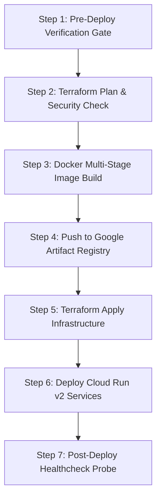

# Workflow: .deploy (Cloud Infrastructure & Service Deployment)

## 1. Objective
Build container images, execute declarative Terraform plans, deploy backend and worker services to Google Cloud Run, configure Pub/Sub topics, and verify live service health.

## 2. Participating Agents
- **DevOps Agent**: Lead deployment engineer.
- **Auditor Agent**: Pre-deployment safety checker.

## 3. Step-by-Step Execution Protocol

### Step 1: Pre-Deploy Verification Gate
1. Assert that `.test` and `.security-audit` workflows have passed with 0 errors.

### Step 2: Terraform Plan & Security Check
1. Execute `terraform plan -out=tfplan` in target environment (`environments/dev` or `environments/prod`).
2. Auditor Agent asserts no unexpected resource deletions or open IAM bindings.

### Step 3: Docker Multi-Stage Image Build
1. Build `agent-x-api` and `agent-x-worker` images using multi-stage Dockerfiles.

### Step 4: Push to Google Artifact Registry
1. Tag with immutable git commit SHA and push to `gcr.io/{project_id}/...`.

### Step 5: Terraform Apply Infrastructure
1. Execute `terraform apply tfplan`.

### Step 6: Deploy Cloud Run v2 Services
1. Deploy API service and Worker pool with configured IAM service accounts and Pub/Sub subscriptions.

### Step 7: Post-Deploy Healthcheck Probe
1. Query `GET https://{service-url}/healthz`. Assert HTTP 200 and healthy Firestore/PubSub connections.

## 4. Exit Criteria & Deliverables
- Deployed Google Cloud Run services with healthy `/healthz` response.
- Active Pub/Sub push subscription connected.
- Deployment manifest recorded in `/docs/CHANGELOG.md`.
