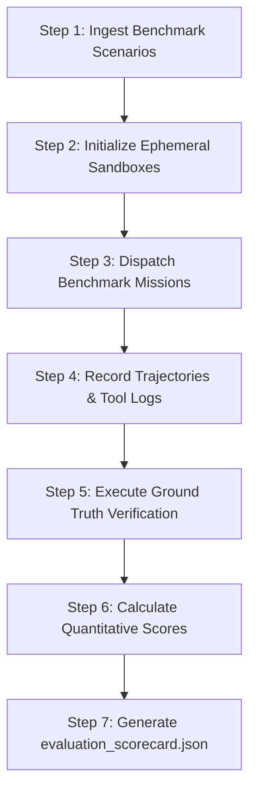

# Workflow: .evaluate (Automated Benchmark Evaluation)

## 1. Objective
Run the 20-scenario quantitative evaluation benchmark suite, evaluate agent trajectories, compute Mission Success Rate (MSR), Verification Fidelity, and Trajectory Efficiency metrics, and output an official evaluation scorecard.

## 2. Participating Agents
- **Coordinator Agent**: Benchmark orchestrator.
- **Auditor Agent**: Impartial metric scorer.

## 3. Step-by-Step Execution Protocol

### Step 1: Ingest Benchmark Scenarios
1. Load 20 benchmark configurations from `/evaluation/benchmarks/*.json`.

### Step 2: Initialize Ephemeral Sandboxes
1. Provision isolated test directories and mock cloud environments for each benchmark run.

### Step 3: Dispatch Benchmark Missions
1. Run runner CLI: `python -m agentx.evaluation.runner --suite all --concurrency 4`.

### Step 4: Record Trajectories & Tool Logs
1. Capture step-by-step agent thoughts, tool invocations, tokens used, and latency into JSONL trace files.

### Step 5: Execute Ground Truth Verification
1. Run ground-truth test assertions against each scenario's generated deliverables.

### Step 6: Calculate Quantitative Scores
1. Compute $\text{MSR} = \frac{\text{Passed}}{\text{Total}} \times 100\%$ (Target $\ge 85\%$).
2. Compute Verification Fidelity Metric ($0\%$ false positives).
3. Compute Trajectory Efficiency Index and Self-Healing Autonomy Ratio ($\ge 70\%$).

### Step 7: Generate Scorecard
1. Output `evaluation_scorecard.json` and Markdown summary to `/eval-results/` and upload to GCS.

## 4. Exit Criteria & Deliverables
- `evaluation_scorecard.json` with MSR $\ge 85\%$.
- Trajectory logs archived in GCS.
