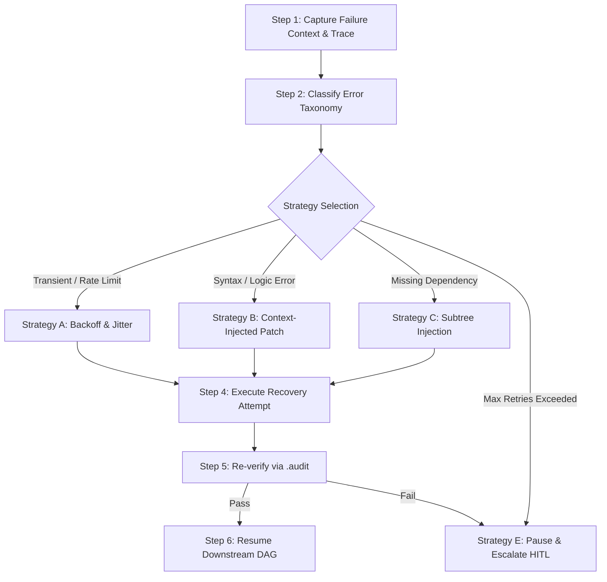

# Workflow: .fix (Failure Diagnosis, Self-Healing & Live Replanning)

## 1. Objective
Diagnose runtime failures, compiler errors, or verification rejections, classify the root cause using the Agent-X Error Taxonomy, apply targeted self-healing strategies, perform live DAG replanning, and recover without crashing the mission.

## 2. Participating Agents
- **Architect Agent**: Diagnostics and DAG replanning.
- **Coder Agent**: Code and configuration patches.
- **Tester Agent**: Regression verification.
- **Coordinator Agent**: Subtree state management.

## 3. Step-by-Step Execution Protocol

### Step 1: Capture Failure Context & Trace
1. Ingest stdout/stderr, stack trace, and verification rejection details from failed task.
2. Freeze all downstream dependent tasks in Firestore (`status: PAUSED`).

### Step 2: Classify Error Taxonomy
1. Map failure to one of: `TRANSIENT_NETWORK`, `RATE_LIMIT_EXCEEDED`, `SYNTAX_COMPILATION_ERROR`, `DEPENDENCY_MISSING`, `PERMISSION_DENIED`, `TEST_ASSERTION_FAILURE`, `TIMEOUT_EXCEEDED`.

### Step 3: Strategy Selection & DAG Replanning
- **Strategy A**: Apply exponential jitter backoff and re-dispatch.
- **Strategy B**: Provide Coder Agent with exact file lines, error stack trace, and failing test diff to generate code patch.
- **Strategy C**: Inject prerequisite repair tasks into the DAG before the failed node.
- **Strategy E**: Transition mission to `PAUSED (HITL_REQUIRED)` and emit push notification.

### Step 4: Execute Recovery Attempt
1. Worker executes the patched task or newly injected repair sub-graph.

### Step 5: Re-verify via `.audit`
1. Re-run Level 1–4 Verification on the recovered task.

### Step 6: Resume Downstream DAG
1. Unpause downstream nodes and continue autonomous execution.

## 4. Exit Criteria & Deliverables
- Resolved task in `VERIFIED` status.
- Replanning audit log committed to Firestore.
- Downstream tasks unlocked and executing.
