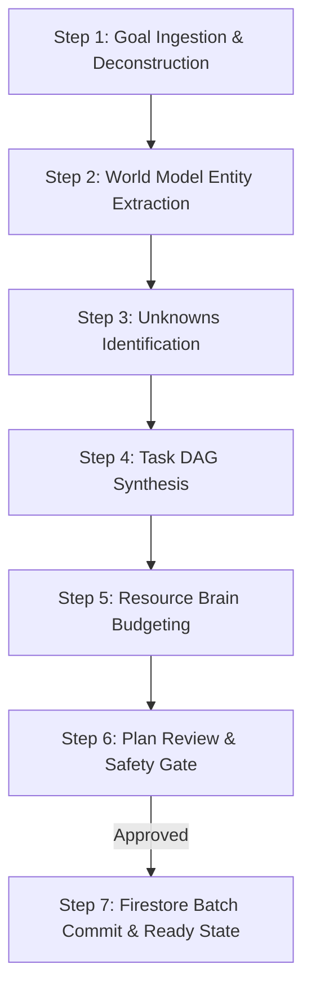

# Workflow: .plan (Mission & Architecture Planning)

## 1. Objective
Transform an open-ended user goal into a validated `GoalContract`, populate the initial World Model semantic entity graph, identify critical unknowns, and synthesize a topologically sorted Task DAG with dynamic resource allocations.

## 2. Participating Agents
- **Coordinator Agent**: Lead orchestrator.
- **Architect Agent**: Entity extraction and DAG design.
- **Auditor Agent**: Feasibility and safety validation.

## 3. Step-by-Step Execution Protocol

### Step 1: Goal Ingestion & Deconstruction
1. Ingest user prompt, context files, repository URLs, and constraint inputs.
2. Invoke Architect Agent with Gemini 2.5 Pro to extract `primary_objective`, `deliverables`, `constraints`, and `success_criteria`.
3. Validate that success criteria are observable and testable.

### Step 2: World Model Entity Extraction
1. Inspect targeted environments (e.g. read repo file trees, cloud service descriptors).
2. Create `WorldModelEntity` records for repositories, services, databases, secrets, and files.
3. Establish directed edges (`DEPENDS_ON`, `MUTATES`, `READS_FROM`, `AUTHENTICATES_VIA`).

### Step 3: Unknowns Identification
1. Identify missing credentials, uninspected endpoints, and ambiguous parameters.
2. Flag identified gaps as `CRITICAL_UNKNOWN` entities.
3. Automatically insert high-priority exploratory tasks to resolve unknowns before non-idempotent tasks.

### Step 4: Task DAG Synthesis
1. Synthesize individual `TaskNode` records with typed inputs, outputs, idempotency keys, and assigned agent roles.
2. Topologically sort the graph and assert acyclicity.

### Step 5: Resource Brain Budgeting
1. Calculate complexity score $C$ for each task and assign model tier (Flash vs Pro).
2. Allocate token caps, timeouts, and max retry limits.
3. Verify total estimated cost is within the mission's USD budget cap.

### Step 6: Plan Review & Safety Gate
1. Auditor Agent evaluates plan against security whitelists and safety constraints.
2. If HITL flag is set, present plan to Mission Commander in PWA for interactive approval.

### Step 7: Firestore Batch Commit
1. Atomically write mission, entities, edges, and tasks to Firestore.
2. Transition mission status to `READY` (or `EXECUTING`).

## 4. Exit Criteria & Deliverables
- Validated Mission Document in Firestore with status `READY`.
- Acyclic Task DAG with at least 1 `READY` task unblocked.
- Initial World Model entity graph visible in Mission Control.
