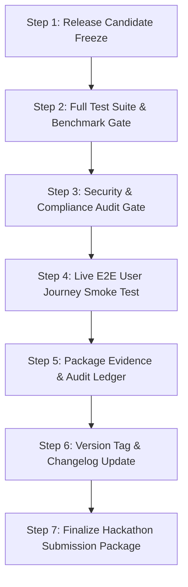

# Workflow: .release (Release Candidate Qualification & Hackathon Submission)

## 1. Objective
Qualify the final release candidate build, package immutable audit evidence ledgers, verify end-to-end user journeys, generate release notes, and finalize the Hackathon Submission Package.

## 2. Participating Agents
- **Coordinator Agent**: Release manager.
- **Auditor Agent**: Release compliance and evidence verification.
- **Architect Agent**: Release notes and documentation synchronization.

## 3. Step-by-Step Execution Protocol

### Step 1: Release Candidate Freeze
1. Create release branch `release/vX.Y.Z` and freeze codebase changes.

### Step 2: Full Test Suite & Benchmark Gate
1. Execute `.test` workflow (100% pass rate, $\ge 85\%$ coverage).
2. Execute `.evaluate` workflow across 20 benchmark scenarios (assert MSR $\ge 85\%$).

### Step 3: Security & Compliance Audit Gate
1. Execute `.security-audit` workflow (0 High/Critical findings).

### Step 4: Live E2E User Journey Smoke Test
1. Execute 3 complete sample missions on live staging Cloud Run environment.
2. Verify Next.js PWA Mission Control rendering, DAG interactivity, log streaming, and push alerts.

### Step 5: Package Evidence & Audit Ledger
1. Aggregate all SHA-256 verification proofs, test XMLs, and diffs into `release_evidence_bundle.zip` in GCS.

### Step 6: Version Tag & Changelog Update
1. Update `CHANGELOG.md` with semantic version, features, and fixes.
2. Tag release in Git: `git tag -a vX.Y.Z -m "Release vX.Y.Z"`.

### Step 7: Finalize Hackathon Submission Package
1. Validate `README.md`, 3-minute video pitch script (`docs/hackathon.md`), live demo URL, and evaluation scorecards.

## 4. Exit Criteria & Deliverables
- Signed Git Release Tag `vX.Y.Z`.
- Production-ready Cloud Run artifacts.
- Complete Hackathon submission materials verified and ready.
