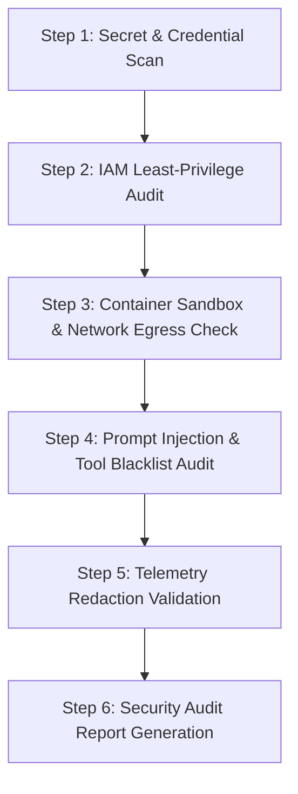

# Workflow: .security-audit (Security & Governance Audit)

## 1. Objective
Audit the entire Agent-X codebase, cloud configurations, container definitions, and execution logs for security vulnerabilities, secret leakage, IAM over-permissioning, prompt injection vectors, and container sandbox escapes.

## 2. Participating Agents
- **Auditor Agent**: Security auditor.
- **DevOps Agent**: Cloud infrastructure and container auditor.

## 3. Step-by-Step Execution Protocol

### Step 1: Secret & Credential Scan
1. Scan entire repository using static analysis tools (`trufflehog`, `gitleaks`, `bandit`).
2. Assert 0 plaintext API keys, tokens, or passwords committed to Git or `.env` files.

### Step 2: IAM Least-Privilege Audit
1. Inspect Terraform IAM modules and Cloud Run service accounts.
2. Assert that no service accounts possess `roles/owner` or `roles/editor`.

### Step 3: Container Sandbox & Network Egress Check
1. Inspect `Dockerfile` definitions.
2. Assert non-root user execution (`USER 1001`), `CAP_DROP_ALL`, and blocked GCP metadata server access.

### Step 4: Prompt Injection & Tool Blacklist Audit
1. Assert that all external context variables are wrapped in `<untrusted_content>` tags.
2. Assert tool execution layer enforces hard blacklists on destructive commands (`rm -rf /`, `gcloud projects delete`).

### Step 5: Telemetry Redaction Validation
1. Run automated redaction filter test suite against high-entropy synthetic keys.
2. Confirm 100% token redaction.

### Step 6: Security Audit Report Generation
1. Produce comprehensive `security_audit_report.md` detailing findings, risk scores, and remediation steps.

## 4. Exit Criteria & Deliverables
- Clean Security Audit Report with 0 High or Critical vulnerabilities.
- Signed compliance certificate committed to GCS.
