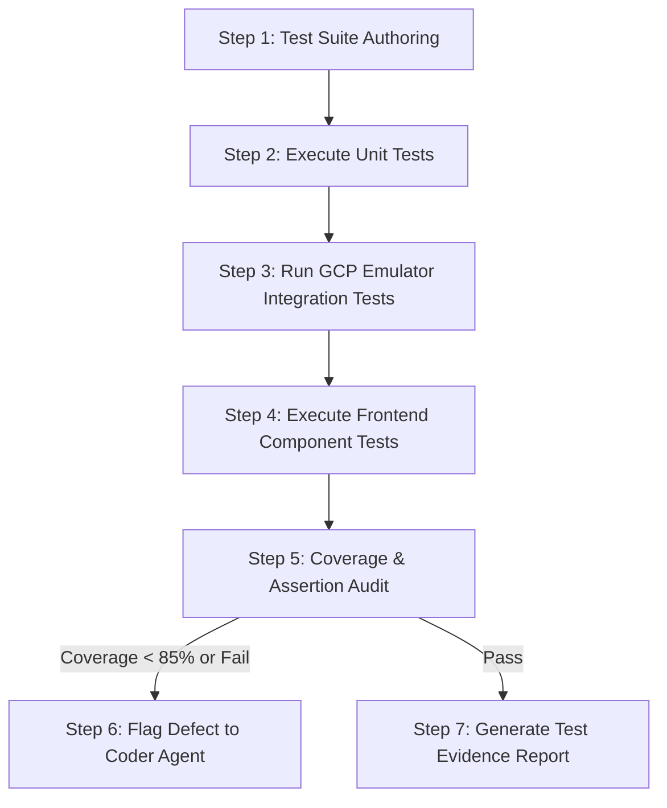

# Workflow: .test (Automated Testing & Integration Verification)

## 1. Objective
Execute all levels of automated testing (unit tests, GCP emulator integration tests, subagent contract tests, and UI component tests), ensuring zero regressions and minimum 85% test coverage.

## 2. Participating Agents
- **Tester Agent**: Authors and runs test suites.
- **Auditor Agent**: Reviews test assertions and coverage metrics.

## 3. Step-by-Step Execution Protocol

### Step 1: Test Suite Authoring
1. Write unit tests for new business logic using `pytest` and `pytest-asyncio`.
2. Add component render and interaction tests with `Vitest` and `@testing-library/react`.

### Step 2: Execute Unit Tests
1. Run `pytest tests/unit -v --cov=agentx --cov-report=term-missing`.
2. Assert 100% pass rate.

### Step 3: Run GCP Emulator Integration Tests
1. Ensure Firestore and Pub/Sub emulators are running locally.
2. Execute async integration tests verifying database writes, transactional locks, and Pub/Sub triggers.

### Step 4: Execute Frontend Component Tests
1. Run `npm run test` in `/frontend`.
2. Verify DAG canvas rendering, terminal log filters, and error boundaries.

### Step 5: Coverage & Assertion Audit
1. Verify line coverage $\ge 85\%$.
2. Auditor Agent asserts that assertions are meaningful and no tests were weakened.

### Step 6: Generate Test Evidence Report
1. Save JUnit XML results (`junit.xml`) and coverage reports to GCS.
2. Produce signed Level 4 test verification summary.

## 4. Exit Criteria & Deliverables
- 100% passing tests across unit, integration, and UI suites.
- Code coverage $\ge 85\%$.
- Test execution logs and XML reports archived in GCS.
