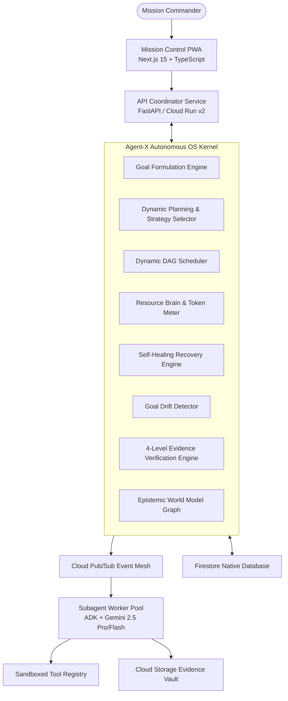

# Agent-X System Architecture Specification

## 1. System Overview

**Agent-X** is an autonomous mission operating system designed for high-reliability, resource-governed engineering execution. It replaces linear, stochastic prompt chaining with a formal, deterministic kernel, an epistemic world model, and a self-healing directed acyclic graph (DAG).

---

## 2. Kernel Subsystems

### 2.1 Epistemic World Model & Unknowns Engine
- **Entity Graph**: Stores code repositories, infrastructure targets, databases, files, and secrets in Firestore.
- **State Partitioning**: Strictly separates `KNOWN_FACT`, `INFERRED_ASSUMPTION`, and `CRITICAL_UNKNOWN`.
- **Unknown Resolution**: Unknowns are prioritized based on dependency impact and deadline pressure ($P(u) = (w_{imp} \cdot I_u + w_{dep} \cdot D_u) \cdot e^{-\lambda t}$) and converted into exploratory DAG subtrees.

### 2.2 Dynamic Workflow Engine
- **Topological Sorter**: Evaluates execution levels, parallelizing independent tasks while strictly enforcing acyclic dependencies.
- **Dynamic Mutation**: Modifies the running graph in-place upon tool failure, drift detection, or operator intervention.

### 2.3 Resource Brain & Dynamic Model Routing
- **Dual-Model Router**:
  - Tasks with complexity $C < 0.40$ route to **Gemini 2.5 Flash / Flash Thinking** (speed, cost-efficiency).
  - Tasks with complexity $C \ge 0.40$ route to **Gemini 2.5 Pro / Frontier Models** (deep reasoning, architecture).
- **Cost Metering**: Calculates exact token rates ($0.075 / 1M Flash input, $1.25 / 1M Pro input) and halts execution before budget caps are breached.

### 2.4 Multi-Strategy Self-Healing Recovery Engine
- **9 Failure Categories**: `TRANSIENT`, `TOOL`, `DATA`, `RESOURCE`, `PERMISSION`, `LOGIC`, `MODEL`, `ENVIRONMENT`, `UNKNOWN`.
- **9 Recovery Strategies**: `RETRY`, `BACKOFF`, `ALTERNATIVE_TOOL`, `ALTERNATIVE_AGENT`, `TASK_MODIFICATION`, `RESOURCE_REALLOCATION`, `WORKFLOW_MUTATION`, `REPLANNING`, `HUMAN_APPROVAL`.

### 2.5 4-Level Evidence Verification Engine
- **Level 1**: Static schema compliance and syntax checks.
- **Level 2**: Execution outputs and process exit codes.
- **Level 3**: Cryptographic SHA-256 deliverable payload hashing.
- **Level 4**: Independent Verifier Agent audit consensus and anti-hallucination verification.

---

## 3. Cloud-Native Deployment Topology

- **Serverless Compute**: Google Cloud Run v2 (`agent-x-api`, `agent-x-worker`).
- **Persistence**: Google Cloud Firestore (Native Mode) with Optimistic Concurrency and Point-in-Time Recovery (PITR).
- **Event Mesh**: Google Cloud Pub/Sub with Dead Letter Queues and retry policies.
- **Evidence Storage**: Google Cloud Storage with uniform bucket-level access and object versioning.
- **Secrets Management**: Google Secret Manager for dynamic credential retrieval.
- **Infrastructure as Code**: 100% managed via modular Terraform (`dev`, `staging`, `prod`).
