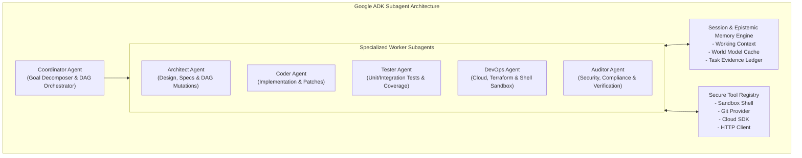
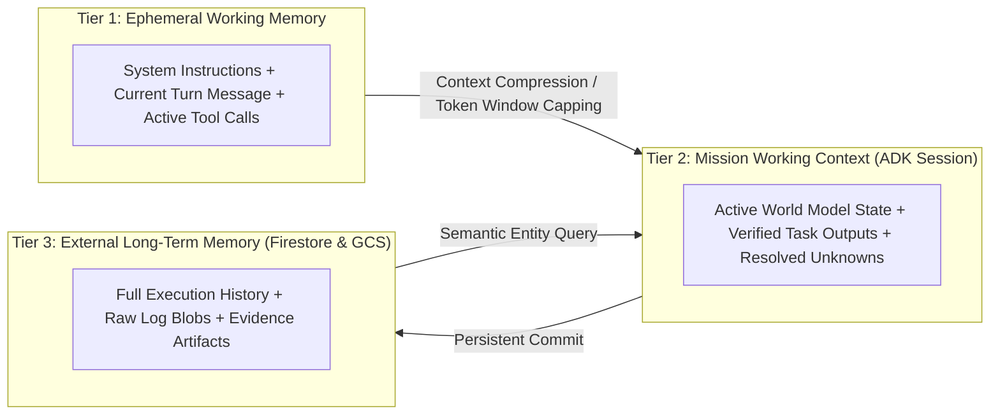

# Agent-X Agent Architecture & ADK Runtime

## 1. Google ADK & Gemini Agent Runtime

Agent-X leverages the **Google Agent Development Kit (ADK)** and the **Google Gen AI SDK** (`google-genai`) to orchestrate multi-agent collaboration with structured input/output schemas, deterministic tool binding, and robust session memory.



---

## 2. Specialized Subagent Personas & Contracts

Every subagent implements a strict operational contract defined by its role, permissions, system prompt, and allowable toolsets.

| Subagent Role | Target Model | Allowed Tools | Input Scope | Primary Output |
| :--- | :--- | :--- | :--- | :--- |
| **Coordinator** | Gemini 2.5 Pro | None (Orchestrator) | User Goal, Mission Constraints, World Model Graph | Task DAG, Replanning Directives |
| **Architect** | Gemini 2.5 Pro | `read_file`, `list_dir`, `web_search` | System specs, existing repo tree, requirements | Architecture specs, ADRs, schema definitions |
| **Coder** | Gemini 2.5 Pro | `read_file`, `write_file`, `patch_file`, `list_dir` | Task specification, interface types, target files | Code changes, unified diffs, PR payloads |
| **Tester** | Gemini 2.5 Pro | `run_test`, `run_sandbox_command`, `read_file` | Code changes, acceptance criteria, test harness | Test scripts, execution logs, coverage reports |
| **DevOps** | Gemini 2.5 Flash / Pro | `terraform_exec`, `gcloud_exec`, `docker_build` | Cloud target, terraform scripts, env vars | Deployed resource IDs, infrastructure logs |
| **Auditor / Verifier** | Gemini 2.5 Pro | `hash_verify`, `artifact_inspect`, `policy_check` | Task deliverables, acceptance criteria, raw logs | Signed `VerificationProof`, compliance audit |

---

## 3. Subagent Task Contract Schema

When the Coordinator dispatches a task to a specialized subagent, it formats the request using the typed Pydantic schema:

```python
from pydantic import BaseModel, Field
from typing import List, Dict, Any, Optional
from enum import Enum


class AgentRole(str, Enum):
    COORDINATOR = "COORDINATOR"
    ARCHITECT = "ARCHITECT"
    CODER = "CODER"
    TESTER = "TESTER"
    DEVOPS = "DEVOPS"
    AUDITOR = "AUDITOR"


class VerificationLevel(str, Enum):
    LEVEL_1_SYNTACTIC = "LEVEL_1_SYNTACTIC"
    LEVEL_2_EXECUTION = "LEVEL_2_EXECUTION"
    LEVEL_3_ARTIFACT = "LEVEL_3_ARTIFACT"
    LEVEL_4_SEMANTIC = "LEVEL_4_SEMANTIC"


class SubagentTaskContract(BaseModel):
    task_id: str = Field(..., description="Unique deterministic task identifier")
    mission_id: str = Field(..., description="Parent mission identifier")
    role: AgentRole = Field(..., description="Target specialized agent persona")
    objective: str = Field(..., description="Concrete, actionable task objective")
    context: Dict[str, Any] = Field(
        default_factory=dict, description="Resolved input parameters and entity states"
    )
    allowed_paths: List[str] = Field(
        default_factory=list, description="Filesystem sandbox whitelist"
    )
    forbidden_paths: List[str] = Field(
        default_factory=list, description="Strictly protected paths (e.g. .git, secrets)"
    )
    expected_outputs: List[str] = Field(
        ..., description="List of expected artifact keys or filenames"
    )
    verification_level: VerificationLevel = Field(..., description="Required proof standard")
    timeout_seconds: int = Field(default=300, description="Hard timeout limit")
    token_budget: int = Field(
        default=50000, description="Max LLM tokens allowed for task execution"
    )


class SubagentTaskOutcome(BaseModel):
    task_id: str
    status: str  # "VERIFIED_PASS" | "EXECUTION_FAILED" | "VERIFICATION_FAILED"
    summary: str
    artifacts_created: List[str]
    evidence_uris: List[str]
    tokens_consumed: int
    execution_duration_ms: int
    error_details: Optional[Dict[str, Any]] = None
    next_recommended_actions: List[str] = Field(default_factory=list)
```

---

## 4. Memory Architecture & Context Window Management

To prevent context drift and hallucination during multi-turn execution, Agent-X implements a three-tier memory model:



### Context Compression Strategy
1. **Dynamic Context Pruning**: Tool outputs exceeding $1,500$ tokens are automatically summarized and stored in GCS; a referenced excerpt with a signed retrieval URI is placed into the prompt context.
2. **State Projection**: Subagents do not receive the entire history of all preceding tasks. They receive only the direct outputs of their immediate DAG parent dependencies.
3. **Structured Working Memory**: The Coordinator maintains a structured key-value cache of verified facts, minimizing repetitive discovery.
