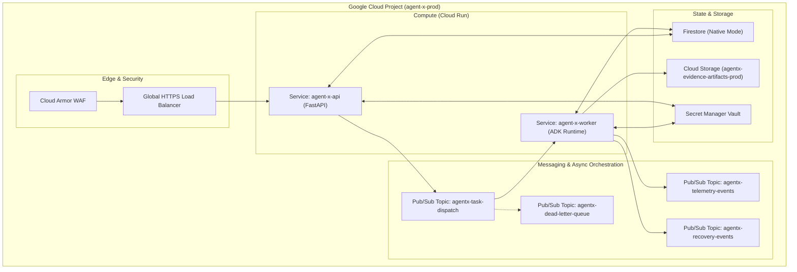

# Agent-X Cloud Infrastructure & Terraform Specification

## 1. GCP Architecture & Resource Map

Agent-X is 100% cloud-native, running entirely on Google Cloud Platform (GCP). All infrastructure is managed declaratively via modular Terraform scripts.



---

## 2. Terraform Module Layout

The infrastructure is organized into reusable Terraform modules under `/terraform/`:

```text
infrastructure/terraform/
├── main.tf
├── variables.tf
├── outputs.tf
├── environments/
│   ├── dev/
│   │   ├── main.tf
│   │   ├── variables.tf
│   │   ├── outputs.tf
│   │   └── terraform.tfvars.example
│   ├── staging/
│   │   ├── main.tf
│   │   ├── variables.tf
│   │   ├── outputs.tf
│   │   └── terraform.tfvars.example
│   └── prod/
│       ├── main.tf
│       ├── variables.tf
│       ├── outputs.tf
│       └── terraform.tfvars.example
└── modules/
    ├── cloud_run/
    │   ├── main.tf
    │   ├── variables.tf
    │   └── outputs.tf
    ├── firestore/
    │   ├── main.tf
    │   ├── variables.tf
    │   └── outputs.tf
    ├── pubsub/
    │   ├── main.tf
    │   ├── variables.tf
    │   └── outputs.tf
    ├── storage/
    │   ├── main.tf
    │   ├── variables.tf
    │   └── outputs.tf
    ├── secret_manager/
    │   ├── main.tf
    │   ├── variables.tf
    │   └── outputs.tf
    ├── iam/
    │   ├── main.tf
    │   ├── variables.tf
    │   └── outputs.tf
    ├── logging/
    │   ├── main.tf
    │   ├── variables.tf
    │   └── outputs.tf
    └── monitoring/
        ├── main.tf
        ├── variables.tf
        └── outputs.tf
```

---

## 3. Terraform Resource Definitions

### 3.1 Cloud Run Configuration (`modules/cloud_run/main.tf`)
```hcl
resource "google_cloud_run_v2_service" "agentx_api" {
  name     = "agent-x-api-${var.environment}"
  location = var.region
  ingress  = "INGRESS_TRAFFIC_ALL"

  template {
    service_account = google_service_account.sa_agentx_api.email
    scaling {
      min_instance_count = 1
      max_instance_count = 20
    }
    containers {
      image = "gcr.io/${var.project_id}/agent-x-api:${var.image_tag}"
      resources {
        limits = {
          cpu    = "2000m"
          memory = "2Gi"
        }
      }
      env {
        name  = "ENVIRONMENT"
        value = var.environment
      }
      env {
        name  = "PROJECT_ID"
        value = var.project_id
      }
    }
  }
}

resource "google_cloud_run_v2_service" "agentx_worker" {
  name     = "agent-x-worker-${var.environment}"
  location = var.region
  ingress  = "INGRESS_TRAFFIC_INTERNAL_ONLY"

  template {
    service_account = google_service_account.sa_agentx_worker.email
    timeout         = "600s"
    scaling {
      min_instance_count = 0
      max_instance_count = 100
    }
    containers {
      image = "gcr.io/${var.project_id}/agent-x-worker:${var.image_tag}"
      resources {
        limits = {
          cpu    = "4000m"
          memory = "4Gi"
        }
      }
      env {
        name  = "ENVIRONMENT"
        value = var.environment
      }
    }
  }
}
```

### 3.2 Pub/Sub Messaging Topics (`modules/pubsub/main.tf`)
```hcl
resource "google_pubsub_topic" "task_dispatch" {
  name = "agentx-task-dispatch-${var.environment}"
}

resource "google_pubsub_topic" "dead_letter" {
  name = "agentx-dead-letter-queue-${var.environment}"
}

resource "google_pubsub_subscription" "worker_task_sub" {
  name  = "agentx-worker-task-sub-${var.environment}"
  topic = google_pubsub_topic.task_dispatch.id

  ack_deadline_seconds = 300

  dead_letter_policy {
    dead_letter_topic     = google_pubsub_topic.dead_letter.id
    max_delivery_attempts = 5
  }

  retry_policy {
    minimum_backoff = "10s"
    maximum_backoff = "300s"
  }

  push_config {
    push_endpoint = "${google_cloud_run_v2_service.agentx_worker.uri}/api/v1/tasks/process"
    oidc_token {
      service_account_email = google_service_account.sa_agentx_pubsub_invoker.email
    }
  }
}
```

### 3.3 Storage Bucket (`modules/storage/main.tf`)
```hcl
resource "google_storage_bucket" "evidence_artifacts" {
  name                        = "agentx-evidence-artifacts-${var.project_id}-${var.environment}"
  location                    = "US"
  uniform_bucket_level_access = true
  versioning {
    enabled = true
  }
  lifecycle_rule {
    action {
      type = "Delete"
    }
    condition {
      age = 90 # Retain audit proofs for 90 days
    }
  }
}
```
