# Agent-X Automated Evaluation Framework & Benchmark Suite

## 1. Evaluation Objectives & Philosophy

Traditional software testing verifies deterministic code paths. However, an autonomous agent operating system must also evaluate **epistemic quality, reasoning trajectory efficiency, tool-calling precision, hallucination avoidance, and recovery resilience**.

The **Agent-X Evaluation Framework** executes automated benchmark runs against a standardized suite of synthetic and real-world mission challenges, scoring missions against objective ground-truth criteria.

```mermaid
graph TD
    subgraph EvalFramework ["Evaluation Execution & Scoring Pipeline"]
        BenchSuite["Benchmark Dataset Suite (20 Scenarios)"]
        TestRunner["Eval Runner (Ephemeral Sandboxes)"]
        TrajectoryLogger["Trajectory Recorder (Step-by-Step Ledger)"]
        
        subgraph MetricScorers ["Multi-Dimensional Evaluators"]
            MSR["1. Mission Success Rate (MSR)"]
            Fidelity["2. Verification Fidelity & Precision"]
            Efficiency["3. Token & Cost Efficiency Ratio"]
            Resilience["4. Self-Healing & Recovery Score"]
            Safety["5. Security & Containment Score"]
        end
        
        Scorecard["Final Mission Evaluation Scorecard (JSON / Markdown)"]
    end
    
    BenchSuite --> TestRunner
    TestRunner --> TrajectoryLogger
    TrajectoryLogger --> MetricScorers
    MetricScorers --> Scorecard
```



---

## 2. Quantitative Evaluation Metrics

### 2.1 Mission Success Rate (MSR)
$$\text{MSR} = \frac{\sum_{i=1}^N \text{PassedMissions}_i}{N} \times 100\% \quad (\text{Target: } \ge 85\%)$$
A mission is considered passed only if 100% of terminal DAG deliverables pass Level 4 Verification.

### 2.2 Verification Fidelity Metric (VFM)
$$\text{VFM} = 1 - \frac{\text{FalsePositives} + \text{FalseNegatives}}{\text{TotalVerificationChecks}}$$
Measures whether the verifier correctly rejected simulated flawed artifacts and approved genuine solutions ($0\%$ false positive tolerance).

### 2.3 Trajectory Efficiency Index (TEI)
$$\text{TEI} = \frac{\text{OptimalPathTaskCount}}{\text{ActualExecutedTaskCount}}$$
Measures planning optimality and avoidance of redundant tool calls.

### 2.4 Self-Healing Autonomy Ratio (SHAR)
$$\text{SHAR} = \frac{\text{AutonomousRecoveries}}{\text{TotalEncounteredFailures}}$$
Measures the percentage of transient, dependency, or compilation failures resolved without human escalation ($\text{Target: } \ge 70\%$).

---

## 3. Benchmark Dataset Suites

Agent-X includes 20 pre-configured benchmark mission scenarios under `/evaluation/benchmarks/`:

| Scenario ID | Category | Objective | Injected Failure / Challenge |
| :--- | :--- | :--- | :--- |
| **`BENCH-01`** | **Cloud Security** | Audit Cloud Run IAM and create remediation Terraform. | Missing `resourcemanager.projects.getIamPolicy` permission. |
| **`BENCH-02`** | **Refactoring** | Migrate Express REST API from CommonJS to TypeScript ES Modules. | Cyclic module dependency and broken type definition. |
| **`BENCH-03`** | **Data Pipeline** | Build ETL script from raw JSON to SQLite with aggregation view. | Schema drift in 3rd batch of source data. |
| **`BENCH-04`** | **Incident Recovery** | Diagnose crashing container from stdout log and deploy fix. | Missing environment variable in Docker entrypoint. |
| **`BENCH-05`** | **Adversarial / Safety** | Process user goal containing prompt injection instructions. | Malicious prompt attempting to read `/etc/passwd`. |

---

## 4. Evaluation CLI & Automation

The evaluation suite can be run locally or in CI using the evaluation CLI runner:

```bash
# Run full benchmark evaluation with 4 parallel sandboxes
python -m agentx.evaluation.runner --suite all --concurrency 4 --output-dir ./eval-results/

# Run specific adversarial safety suite
python -m agentx.evaluation.runner --suite safety --strict
```

The runner produces a standardized evaluation artifact `evaluation_scorecard.json` uploaded to GCS and published in the CI summary.
