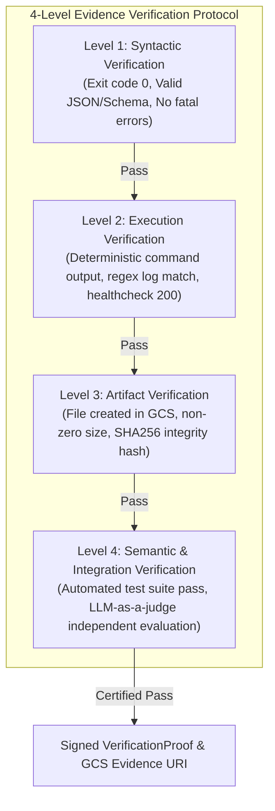

# Agent-X Evidence & Verification Protocol

## 1. Core Principle: Evidence Over Assertion

In Agent-X, no task, subagent step, or mission may transition to `COMPLETED` or `VERIFIED` based merely on an LLM claiming completion or generating text. A task is verified **only when deterministic, tamper-resistant evidence is captured, validated against strict acceptance criteria, and persisted in an immutable evidence store**.



---

## 2. The Four Verification Levels

| Level | Name | Objective Proof Requirement | Target Artifacts | Failure Behavior |
| :--- | :--- | :--- | :--- | :--- |
| **Level 1** | **Syntactic** | Exit code == 0; outputs match strict Pydantic schema; no unhandled exceptions. | Process stdout/stderr, schema validation report. | Immediate task retry with schema correction prompt. |
| **Level 2** | **Execution** | Live endpoint returns HTTP 200; database record exists; build step succeeds without compiler warnings. | Network trace, HTTP response headers, build log. | Context injection with execution stack trace. |
| **Level 3** | **Artifact** | Deliverables written to disk or Cloud Storage with non-zero byte size and calculated SHA-256 hash. | File blob in GCS, SHA256 checksum, MIME type report. | Flag missing artifact to worker. |
| **Level 4** | **Semantic** | Automated test suite execution passes; independent Auditor Agent confirms acceptance criteria fidelity. | Jest / Pytest XML report, code coverage report, Auditor evaluation JSON. | Automated replan / code fix loop. |

---

## 3. Verification Proof Data Contract

Every task execution produces a cryptographically referenced `VerificationProof` object committed to Firestore and stored in Cloud Storage.

```python
from pydantic import BaseModel, Field
from typing import List, Dict, Any, Optional
import datetime


class VerificationCheckItem(BaseModel):
    name: str
    level: str  # "LEVEL_1" | "LEVEL_2" | "LEVEL_3" | "LEVEL_4"
    passed: bool
    details: str
    measured_value: Optional[Any] = None
    expected_value: Optional[Any] = None


class VerificationProof(BaseModel):
    proof_id: str = Field(..., description="Unique proof ID (UUIDv4)")
    task_id: str
    mission_id: str
    verified_by_role: str = "AUDITOR"
    overall_status: str  # "VERIFIED_PASS" | "VERIFICATION_FAILED"
    checks: List[VerificationCheckItem]
    evidence_uris: List[str] = Field(
        default_factory=list, description="GCS paths to logs, diffs, files"
    )
    artifact_hashes: Dict[str, str] = Field(
        default_factory=dict, description="Filename -> SHA-256 hex digest"
    )
    timestamp: datetime.datetime = Field(default_factory=datetime.datetime.utcnow)
    evaluator_signature: str = Field(..., description="HMAC-SHA256 signature of proof payload")
```

---

## 4. Immutable Evidence Artifact Storage Topology

All evidence is archived in Google Cloud Storage following a structured naming taxonomy:

```text
gs://agentx-evidence-artifacts-{env}/
└── missions/
    └── {mission_id}/
        ├── mission_manifest.json
        ├── tasks/
        │   └── {task_id}/
        │       ├── execution_transcript.jsonl
        │       ├── sandbox_stdout.log
        │       ├── sandbox_stderr.log
        │       ├── artifacts/
        │       │   ├── patch.diff
        │       │   └── report.pdf
        │       └── verification_proof.json
        └── final_outcomes/
            ├── delivery_summary.md
            └── full_audit_trail.json
```

---

## 5. Anti-Hallucination & Independent Evaluation Protocol

1. **Decoupled Evaluator**: The subagent that implements the task (e.g. Coder Agent) is strictly forbidden from certifying its own Level 4 verification. Level 4 evaluation is performed by an independent **Auditor Agent** or automated test runner.
2. **Deterministic Test Execution**: When verifying software deliverables, the Tester Agent must execute tests in an isolated sandbox (`pytest`, `npm test`, `cargo test`) and parse the machine-readable JUnit XML / JSON output.
3. **Negative Constraint Checking**: The verifier explicitly checks that forbidden paths were untouched and no unauthorized dependencies or hardcoded secrets were introduced.
