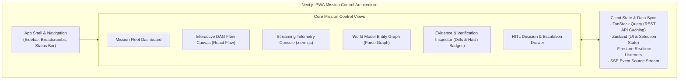

# Agent-X Frontend Architecture & Mission Control PWA

## 1. Frontend Architecture & Design Philosophy

**Agent-X Mission Control** is a progressive web application (PWA) built with **Next.js (App Router)** and **TypeScript**. It provides Mission Commanders with a cockpit to initialize, visualize, steer, and audit autonomous missions in real time.

---

## 2. Design System & Aesthetics

Agent-X adopts a **Cyber-Mission Operations** visual aesthetic:
- **Palette**: Sleek dark mode (`bg-slate-950`, `border-slate-800`), electric cyan accents (`text-cyan-400`, `border-cyan-500/30`), emerald green for verified statuses (`text-emerald-400`), amber for HITL pauses (`text-amber-400`), and crimson for failed nodes (`text-rose-500`).
- **Typography**: Inter / Outfit for structural hierarchy; JetBrains Mono for telemetry logs, entity keys, and code diffs.
- **Micro-Interactions**: Subtle glow pulse animations on actively executing DAG nodes, smooth layout transitions via Framer Motion, and instant keyboard shortcuts (`Space` to pause, `Esc` to close inspector, `Cmd+K` command palette).

---

## 3. Core UI Components & Views

The Mission Control PWA provides 12 specialized pages reflecting real backend state with zero faked progress:

| Route | Page / View | Key Capabilities |
| :--- | :--- | :--- |
| `/` | **Dashboard** | Fleet overview, active missions, aggregate token/dollar burn, and rapid mission launch. |
| `/missions/new` | **New Mission** | Goal formulation wizard, budget controls, execution constraints, and initial repository inputs. |
| `/missions/[id]` | **Mission Overview** | Centralized mission status, active phase, live progress bar, and real-time execution statistics. |
| `/missions/[id]/graph` | **Mission Graph** | Interactive React Flow DAG with dynamic node states, retry counters, and topology inspection. |
| `/missions/[id]/tasks` | **Tasks** | Detailed task roster, status filters, agent role assignment, dependency visualization, and logs. |
| `/missions/[id]/agents` | **Agents** | Multi-agent runtime roster, active memory context, tool permissions, and specialization metrics. |
| `/missions/[id]/resources` | **Resource Monitor** | 6-dimensional resource monitor (`allocated`, `consumed`, `remaining`, `reserved`) and causal "WHY" change history. |
| `/missions/[id]/evidence` | **Evidence Explorer** | Claim verification inspector, confidence scoring, supporting/conflicting sources, and Level 1–4 cryptographic proofs. |
| `/missions/[id]/failures` | **Failure Center** | 7-attribute failure diagnostics (9 error categories, 9 self-healing strategies, replacements, resource reallocations) and chronological mission timeline. |
| `/missions/[id]/decisions` | **Decisions & Approvals** | Human-in-the-Loop (HITL) escalation queue with one-click approval, rejection, and parameter overrides. |
| `/missions/[id]/artifacts` | **Artifact Center** | Categorized deliverables (`Reports`, `Datasets`, `Presentations`, `Summaries`, `Evidence Packages`), SHA-256 verification badges, modal previews, and instant file downloader. |
| `/settings` | **Settings** | API connection parameters, dark theme controls, and notification preferences. |

---

## 4. PWA & Offline Support

- **Service Worker (`next-pwa` / Workbox)**:
  - Cache static assets (JS bundles, CSS, fonts, SVG icons).
  - Background sync for human intervention decisions submitted while offline.
  - Web Push API integration for critical mission alerts (e.g. "Task 4 failed: Human decision required").
- **Web App Manifest**: Fullscreen mobile/desktop standalone capability with custom icons and theme color `#030712`.
