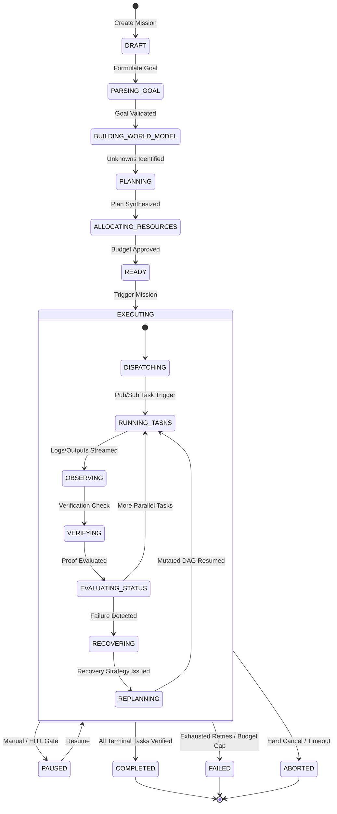

# Agent-X Functional Requirements Specification

## 1. Mission Lifecycle & State Machine

Every Agent-X mission must strictly follow a deterministic state machine with verifiable transition conditions.



### 1.1 State Definitions & Transition Criteria
- **`DRAFT`**: Initial mission payload received from user.
- **`PARSING_GOAL`**: Gemini 2.5 extracts primary objective, constraints, deliverables, and acceptance criteria.
- **`BUILDING_WORLD_MODEL`**: Initial entities, environmental facts, API dependencies, and critical unknowns are registered in Firestore.
- **`PLANNING`**: Task DAG generated. All task dependencies, idempotency flags, and expected outputs mapped.
- **`ALLOCATING_RESOURCES`**: Resource Brain assigns token limits, compute timeout, max retries, and estimated cost.
- **`READY`**: Mission is armed and waiting for automated start or human confirmation (if HITL flag is set).
- **`EXECUTING`**: Active execution of tasks across Cloud Run workers.
- **`PAUSED`**: Execution suspended due to HITL gate, ambiguous decision point, or user pause.
- **`COMPLETED`**: All DAG nodes are in `VERIFIED` state, and final mission deliverables are generated.
- **`FAILED`**: Unrecoverable error or budget exhaustion encountered.
- **`ABORTED`**: Explicit cancellation by user or system watchdog.

---

## 2. Detailed Functional Modules

### 2.1 Goal Formulation Engine (FR-GF)
- **FR-GF-01 (Goal Ingestion)**: Accept freeform natural language text, attached architecture files, code snippets, or API specs.
- **FR-GF-02 (Deconstruction)**: Transform user intent into a structured `GoalContract`:
  - `primary_objective`: String
  - `deliverables`: List of expected files, PRs, or data outputs
  - `constraints`: Execution rules (e.g. read-only against prod DB, budget max $5)
  - `success_criteria`: Observable, boolean test conditions

### 2.2 World Model & Unknowns Engine (FR-WM)
- **FR-WM-01 (Entity Extraction)**: Extract infrastructure components, files, repositories, credentials, and actors into semantic nodes.
- **FR-WM-02 (Relationship Graph)**: Model directed edges between entities (`depends_on`, `mutates`, `reads_from`, `authorizes`).
- **FR-WM-03 (Unknowns Register)**: Identify and catalog epistemic gaps (e.g. missing API token, untested endpoint schema, ambiguous branch name).
- **FR-WM-04 (Discovery Dispatch)**: Automatically generate high-priority exploratory tasks to resolve unknowns before mutating downstream state.

### 2.3 Workflow & DAG Synthesis Engine (FR-WF)
- **FR-WF-01 (DAG Synthesis)**: Generate a topologically sorted DAG where each node is a `TaskNode`:
  ```json
  {
    "task_id": "task-001",
    "name": "Audit Cloud Run Security Settings",
    "agent_role": "SECURITY_ANALYST",
    "inputs": { "service_name": "agent-x-api" },
    "expected_outputs": [ "security_audit_report.json" ],
    "dependencies": [],
    "idempotent": true,
    "max_retries": 3,
    "timeout_seconds": 180,
    "verification_level": "LEVEL_3_ARTIFACT"
  }
  ```
- **FR-WF-02 (Dynamic Parallelism)**: Execute ready tasks concurrently across separate Cloud Run worker instances via Pub/Sub.
- **FR-WF-03 (DAG Mutation / Dynamic Replanning)**: Support live DAG surgery: adding repair nodes, bypassing redundant tasks, and dynamically remapping dependencies.

### 2.4 Resource Brain & Governance (FR-RB)
- **FR-RB-01 (Cost & Token Metering)**: Track input tokens, output tokens, cached tokens, tool invocation counts, and wall-clock execution time per task.
- **FR-RB-02 (Dynamic Throttling & Model Routing)**: Direct simple observational/formatting tasks to fast, low-cost models (Gemini Flash) and reserve reasoning/synthesis for flagship models (Gemini Pro).
- **FR-RB-03 (Budget Hard Cap)**: Automatically pause or fail a mission if the allocated financial budget or token cap is exceeded.

### 2.5 Worker Execution & Google ADK Runtime (FR-EX)
- **FR-EX-01 (Role-Based Subagents)**: Instantiation of specialized subagents using Google ADK:
  - *Architect Agent*: System decomposition and DAG synthesis.
  - *Coder Agent*: Code generation, refactoring, and patch creation.
  - *Tester Agent*: Unit test authoring, test execution, and coverage analysis.
  - *DevOps Agent*: Cloud deployment, terraform execution, and service monitoring.
  - *Auditor Agent*: Security review, verification validation, and risk analysis.
- **FR-EX-02 (Sandboxed Tool Execution)**: Provide controlled tool environments (Bash execution in ephemeral containers, Git CLI, HTTP Client, Cloud SDK).

### 2.6 Evidence, Verification & Observation (FR-EV)
- **FR-EV-01 (Multi-Level Proof Hierarchy)**: Enforce 4-tier verification on all completed tasks:
  - **Level 1 (Syntactic)**: Schema validation, JSON parsing, exit code 0.
  - **Level 2 (Execution)**: Process output validation, regex log pattern match.
  - **Level 3 (Artifact)**: File persistence in GCS, SHA256 integrity hash verification.
  - **Level 4 (Semantic / Integration)**: Automated test execution pass, LLM-as-a-judge independent criteria validation.
- **FR-EV-02 (Immutable Evidence Store)**: Upload all execution transcripts, screenshots, outputs, and diffs to Google Cloud Storage.

### 2.7 Automated Recovery Engine (FR-RC)
- **FR-RC-01 (Error Classification)**: Classify task failures into: `TRANSIENT_NETWORK`, `SYNTAX_ERROR`, `DEPENDENCY_MISSING`, `PERMISSION_DENIED`, `LOGIC_ASSERTION_FAILED`, `TIMEOUT`.
- **FR-RC-02 (Self-Healing Strategies)**:
  - *Strategy A (Exponential Jitter Backoff)*: For transient network / rate limit issues.
  - *Strategy B (Context Injection & Code Fix)*: Re-invoke agent with exact error stack trace and test output.
  - *Strategy C (Dependency Insertion)*: Dynamically inject prerequisite task (e.g. `npm install`, `gcloud auth`).
  - *Strategy D (Alternative Tool Routing)*: Fall back to alternative discovery mechanism if primary tool fails.
  - *Strategy E (HITL Escalation)*: Alert operator when automated strategies fail or permission boundary is hit.

### 2.8 Mission Control PWA (FR-FE)
- **FR-FE-01 (Mission Dashboard)**: Real-time mission list, status badges, cost metrics, and duration counters.
- **FR-FE-02 (Interactive DAG Graph)**: Zoomable, pannable directed graph with node status colors, pulse animations for active nodes, and failure highlights.
- **FR-FE-03 (Live Telemetry Terminal)**: Streaming WebSocket/SSE terminal log with structured filtering by log level, subagent role, and task ID.
- **FR-FE-04 (World Model Visualizer)**: Force-directed or hierarchical entity graph viewer.
- **FR-FE-05 (Evidence & Deliverables Viewer)**: Markdown renderer, diff inspector, artifact download, and verification badge display.
