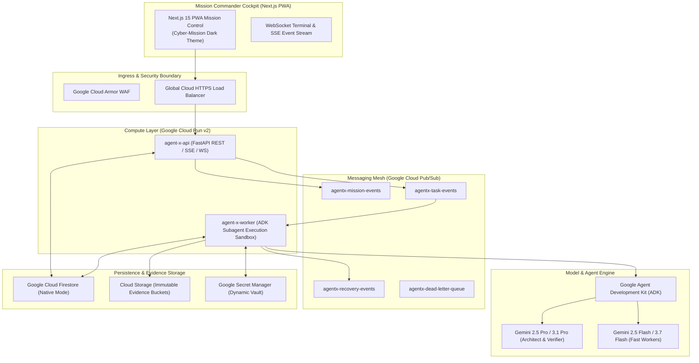

# Hackathon Submission: System Architecture

Agent-X operates as a distributed, event-driven, cloud-native architecture on Google Cloud Platform:

---

## Key Architectural Principles

1. **Kernel State Isolation**: Mission state, Task state, and Epistemic graph are cleanly separated and updated via atomic Firestore transactions and in-memory thread-safe locks.
2. **Asynchronous Task Dispatch**: Long-running subagent tasks execute decoupled from HTTP requests over Pub/Sub topics with exponential backoff and dead-letter queue containment.
3. **Defense-in-Depth Sandboxing**: All tool invocations occur with dropped capabilities, SSRF filters, path traversal sanitization, and AST-parsed code evaluation.
