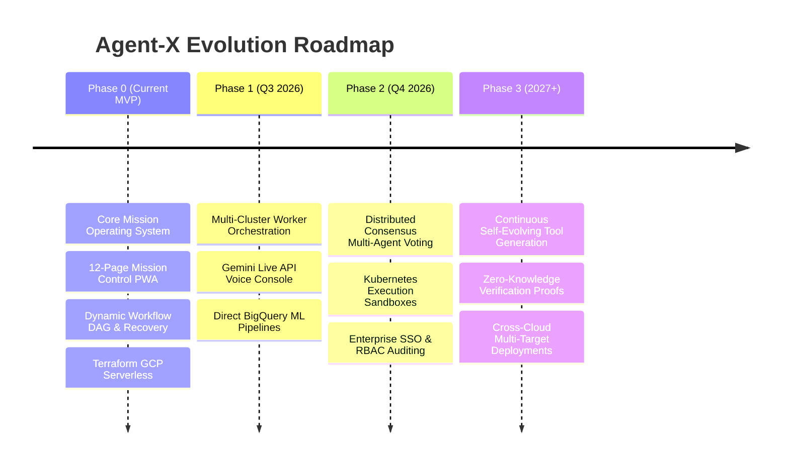

# Hackathon Submission: Future Roadmap

The post-hackathon roadmap for Agent-X focuses on expanding enterprise integrations, multi-cloud execution targets, and reinforcement-guided agent policy optimization:

---

## 🗺️ Engineering Roadmap

### Key Upcoming Capabilities
1. **Gemini Live API Integration**: Real-time voice interruption and continuous audio steering from the Mission Control cockpit.
2. **Kubernetes Ephemeral Pods**: Sandboxing intensive builds and compilation inside disposable Google Kubernetes Engine (GKE) Autopilot worker pods.
3. **Automated Skill Synthesis**: Empowering verifier agents to automatically turn successful mission recovery trajectories into permanent reusable Agent Skills.
