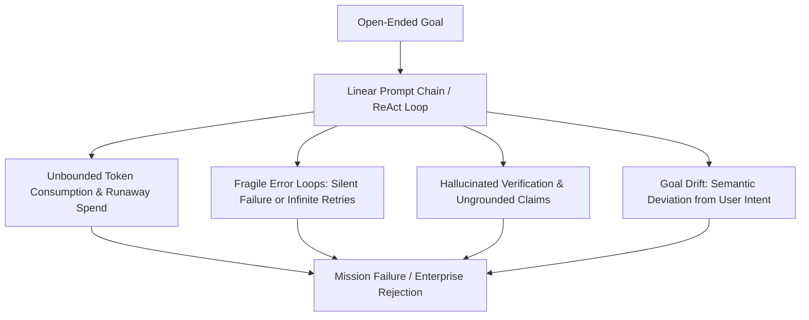

# Hackathon Submission: The Problem

## Why Autonomous AI Agents Fail in Production

Current LLM agent frameworks suffer from fundamental architectural flaws that prevent them from operating reliably on real-world, high-stakes engineering missions:

### 1. The Stochastic Execution Problem (Zero Determinism)
- Most agent frameworks rely on single-thread ReAct loops or brittle chat chains. When an agent encounters unexpected tool errors, compiler warnings, or network drops, it often spirals into repetitive hallucinated tool calls or terminates prematurely.
- There is no dynamic, Directed Acyclic Graph (DAG) state machine capable of repairing workflow topologies at runtime.

### 2. The Runaway Cost Problem (No Resource Brain)
- Agent missions frequently burn through hundreds of dollars in API credits without completing the core objective.
- Existing tools lack real-time predictive token governance, rate limit backpressure, or dynamic model routing (e.g., using Gemini 2.5 Flash for routine extraction and Gemini 2.5 Pro for deep architectural planning).

### 3. The Unverified Output Problem (Fake Progress & Hallucination)
- Agents frequently mark tasks as "complete" simply because code was generated or an API returned HTTP 200, without executing real verification protocols, creating cryptographic evidence hashes, or validating runtime integrity.

### 4. Goal Drift & Semantic Deviation
- As execution depth increases, agents lose grounding in the original user mission statement, executing irrelevant sub-tasks that waste compute and compromise deliverables.

---

## The Agent-X Imperative

Agent-X solves these critical bottlenecks by treating autonomous agent execution as a **Mission Operating System** with formal kernel state machines, epistemic world modeling, multi-tier resource governance, self-healing recovery, and cryptographic evidence verification.
