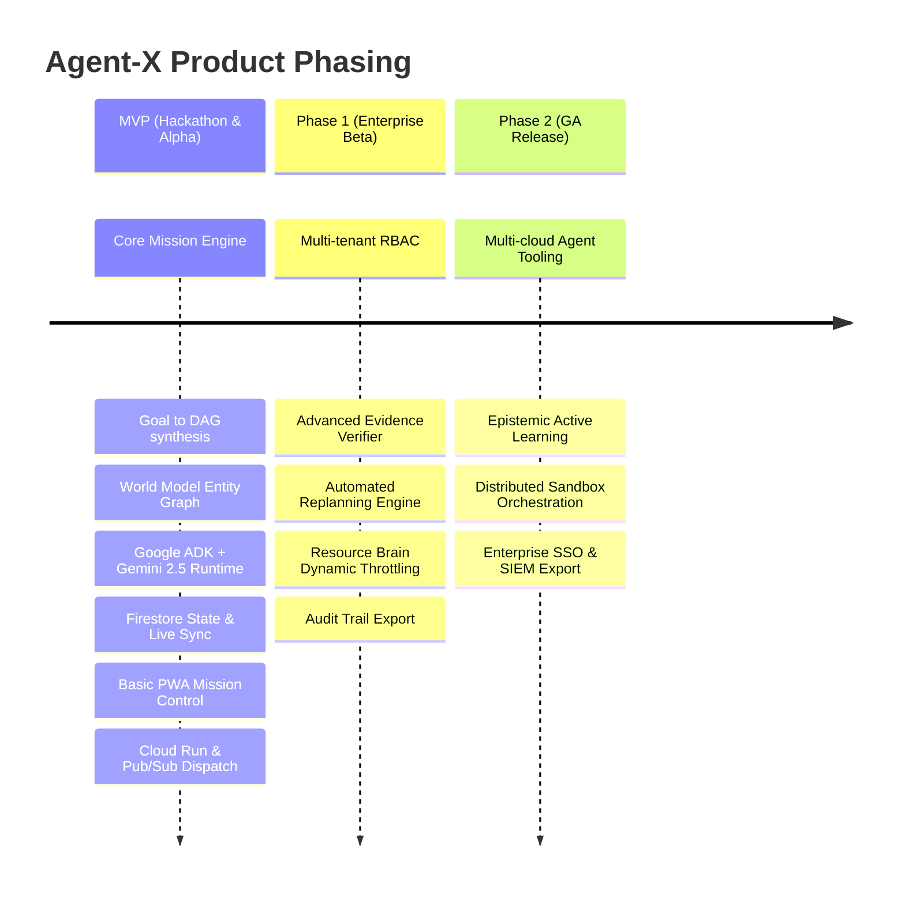

# Agent-X Product Requirements Document (PRD)

## 1. Product Overview & Strategic Goals

**Product Name:** Agent-X  
**Category:** Autonomous Mission Operating System  
**Core Objective:** Empower users to initiate complex, multi-agent missions from high-level objectives, providing deterministic execution, real-time visual monitoring, verifiable outputs, and automated self-healing.

---

## 2. Target Users & User Stories

### 2.1 Primary Personas
- **Mission Commander (Lead Developer / DevOps Architect / Data Engineer)**: Designs, triggers, and oversees autonomous technical workflows.
- **Auditor / Reviewer (Security & Compliance Officer)**: Inspects execution logs, evidence artifacts, and verification chains for compliance.
- **System Administrator**: Manages resource quotas, API keys, compute bounds, and team permissions.

### 2.2 Core User Stories
- **US-1 (Mission Initialization)**: *As a Mission Commander*, I want to submit a broad goal (e.g., "Analyze GCP project security posture, produce remediation PR, and verify test suite pass") so that Agent-X can break it down into an executable DAG.
- **US-2 (Interactive World & Plan Inspection)**: *As a Mission Commander*, I want to inspect the parsed World Model entities and dynamic task DAG in real time, with the ability to pause, modify parameters, or approve critical milestones.
- **US-3 (Autonomous Resource Governance)**: *As a System Administrator*, I want to enforce hard limits on dollar spend, token usage, and runtime per mission so that costs remain strictly predictable.
- **US-4 (Real-time Telemetry & Stream)**: *As a Mission Commander*, I want to view live agent logs, sub-agent spawning, and status transitions via a high-performance web/PWA interface.
- **US-5 (Evidence Verification)**: *As an Auditor*, I want to inspect verifiable cryptographic evidence and execution artifacts proving that every task succeeded according to its acceptance criteria.
- **US-6 (Automated Self-Healing)**: *As a Mission Commander*, I want failed tasks to be automatically diagnosed, recovered, and replanned without manual intervention unless a critical escalation threshold is reached.

---

## 3. Product Scope & Phasing

### 3.1 MVP In-Scope (Phase 0 / Hackathon)
- High-level Goal Formulation with Gemini 2.5 Pro reasoning.
- World Model entity extraction and JSON-graph representation in Firestore.
- Dynamic Task DAG generation with explicit dependency resolution and parallelism.
- Worker execution with Google ADK running on Google Cloud Run workers via Pub/Sub triggers.
- Four-level Evidence Verification protocol (Syntax, Execution, Artifact, Semantic).
- Closed-loop recovery with automated error classification and replan dispatch.
- Next.js / TypeScript PWA frontend featuring real-time DAG visualization, live execution console, entity inspector, and evidence viewer.
- Automated evaluation harness with synthetic test missions.

### 3.2 Non-Goals (Out of Scope for Initial Release)
- Autonomous direct financial transaction execution (e.g. purchasing third-party SaaS licenses).
- Physical hardware robot control interfaces.
- Unmonitored root access to production infrastructure without human-in-the-loop (HITL) confirmation gates.
- Multi-cloud federation outside Google Cloud Platform (AWS/Azure support deferred to Phase 2).

---

## 4. Key Performance Indicators (KPIs)

1. **Mission Success Rate (MSR)**: $\ge 85\%$ autonomous completion without fatal human intervention across benchmark datasets.
2. **Verification Fidelity**: $0\%$ false-positive completions on tasks containing simulated failure conditions.
3. **Recovery Autonomy**: $\ge 70\%$ transient and recoverable errors resolved autonomously via local retry or DAG replan.
4. **End-to-End Latency**: DAG synthesis $< 8$ seconds; state update stream latency to PWA $< 250\text{ ms}$.
5. **Cost Compliance**: $100\%$ adherence to hard token and financial budgets per mission.
