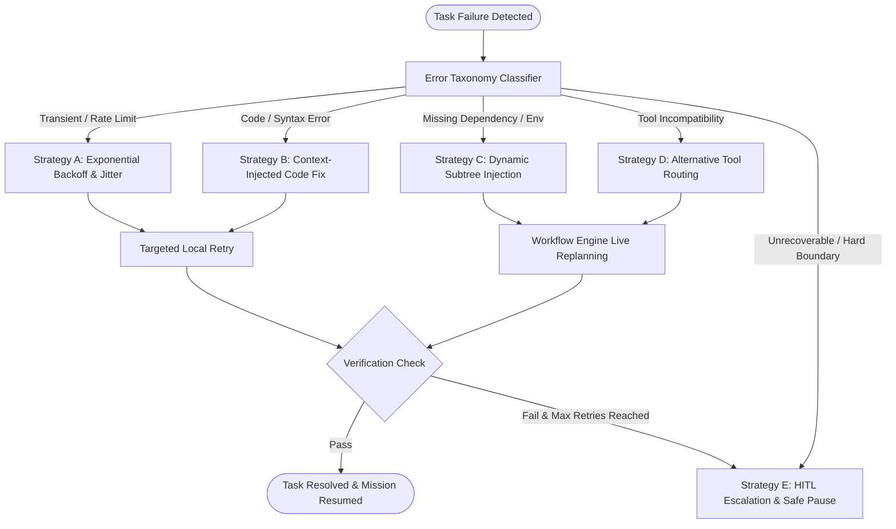

# Agent-X Automated Recovery & Self-Healing Engine

## 1. Resilience Philosophy & Recovery Loop

In autonomous mission execution, failure is not an unexpected anomaly; it is an inevitable operating condition. Real-world systems encounter network latency, API rate limits, schema drift, incomplete documentation, and test regressions.

Agent-X implements an automated, tiered recovery engine designed to diagnose, isolate, heal, and replan without crashing the overarching mission:



---

## 2. Comprehensive Error Taxonomy

| Error Class | Root Cause Symptoms | Automated Recovery Strategy | Max Retries |
| :--- | :--- | :--- | :--- |
| **`TRANSIENT_NETWORK`** | HTTP 502/503/504, connection reset, DNS timeout | Exponential backoff with full jitter: $t = 2^k \cdot \text{base} + \text{rand}(0, 1)$ | 5 |
| **`RATE_LIMIT_EXCEEDED`** | HTTP 429, Gemini ResourceExhausted | Pub/Sub message release with delayed delivery, model fallback | 4 |
| **`SYNTAX_COMPILATION_ERROR`** | `SyntaxError`, `tsc` build failure, missing closing brace | Coder Agent re-invoked with exact compiler line errors | 3 |
| **`DEPENDENCY_MISSING`** | `ModuleNotFoundError`, command not found | Dynamic injection of installer task (`npm install`, `pip install`) | 2 |
| **`PERMISSION_DENIED`** | HTTP 401/403, GCP IAM `PERMISSION_DENIED` | Secret re-fetch; if IAM missing, escalate to HITL | 1 |
| **`TEST_ASSERTION_FAILURE`** | Unit/integration test fails on expected value | Tester & Coder pair to inspect failure diff and patch code | 3 |
| **`TIMEOUT_EXCEEDED`** | Task wall-clock exceeds allocated SLA | Worker instance kill, subagent token budget double-check | 2 |

---

## 3. Rollback & State Isolation Protocol

To ensure system integrity when a non-idempotent task fails midway:

1. **Git Branch Isolation**: Every code-modifying mission operates in an isolated temporary Git branch (`agentx/mission-{mission_id}`). In the event of an unrecoverable failure, the branch is preserved for human debugging and the main branch remains completely untouched.
2. **State Checkpointing**: Before executing any task with `mutates: true`, the worker records a state checkpoint in Firestore containing the pre-execution entity state and Git commit hash.
3. **Targeted Rollback**: If verification fails after maximum retries, the Workflow Engine initiates an automated rollback task that resets the filesystem or cloud resource to the pre-task checkpoint.

---

## 4. Human-in-the-Loop (HITL) Escalation

When automated recovery strategies are exhausted or when a mission hits a designated safety envelope:

```python
class HITLEscalationEvent(BaseModel):
    escalation_id: str
    mission_id: str
    task_id: str
    error_class: str
    diagnosis: str
    attempted_strategies: List[str]
    suggested_human_actions: List[str]
    current_mission_state: str  # "PAUSED"
    created_at: datetime.datetime
```

- **Mission Pause**: Mission status switches immediately to `PAUSED (AWAITING_HUMAN_INPUT)`.
- **Push Notification**: The PWA Service Worker alerts the Mission Commander with a direct link to the recovery console.
- **Interactive Remediation**: The Mission Commander can provide missing credentials, modify task parameters, edit code in-browser, or force a specific replanning path before resuming.
