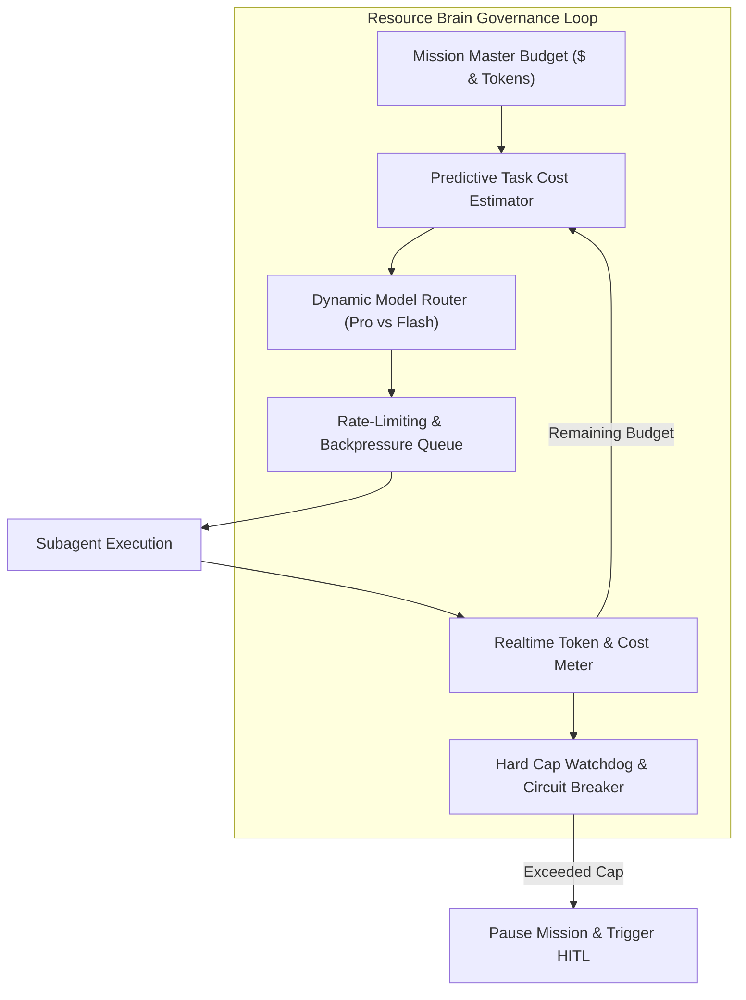

# Agent-X Resource Brain & Dynamic Governance

## 1. Objectives & Governance Architecture

Autonomous agents frequently incur runaway costs, hit LLM rate limits, and suffer thread deadlocks when unconstrained. The **Resource Brain** is the central quantitative controller of Agent-X. It calculates, assigns, enforces, and adapts operational budgets across four distinct dimensions:
1. **Token Budgets**: Input, output, and cached context tokens.
2. **Financial Cost ($ USD)**: Direct API consumption and Cloud Run compute costs.
3. **Wall-Clock Time (SLA)**: Per-task timeouts and mission-wide hard caps.
4. **Tool & Rate Quotas**: Invocations per minute (RPM) and queries per second (QPS) across external APIs.



---

## 2. Dynamic Model Routing Algorithm

Agent-X optimizes cost and performance by dynamically assigning the most appropriate Gemini model to each task node:

$$\text{Selected Model} = \begin{cases} 
\text{Gemini 2.5 Flash} & \text{if } \text{ComplexityScore} < 0.4 \land \text{IsExploratory} = \text{true} \\
\text{Gemini 2.5 Pro} & \text{if } \text{ComplexityScore} \ge 0.4 \lor \text{RequiresDeepReasoning} = \text{true}
\end{cases}$$

### Routing Matrix

| Task Category | Default Model | Token Allocation Ceiling | Timeout Limit | Rationale |
| :--- | :--- | :--- | :--- | :--- |
| **Log Filtering / Regex Extraction** | Gemini 2.5 Flash | 8,000 tokens | 30 seconds | High throughput, minimal reasoning required. |
| **Syntactic Verification (JSON/Schema)** | Gemini 2.5 Flash | 4,000 tokens | 20 seconds | Deterministic parsing. |
| **Goal Deconstruction & Planning** | Gemini 2.5 Pro | 60,000 tokens | 90 seconds | High structural complexity, critical DAG integrity. |
| **Code Generation & Complex Refactoring** | Gemini 2.5 Pro | 100,000 tokens | 300 seconds | High epistemic fidelity, syntax & logic precision. |
| **Semantic & Test Pass Verification** | Gemini 2.5 Pro | 40,000 tokens | 120 seconds | Multi-variable criterion evaluation. |
| **Root-Cause Analysis & Replanning** | Gemini 2.5 Pro | 80,000 tokens | 180 seconds | Complex failure diagnostics. |

---

## 3. Cost & Quota Data Model

```python
from pydantic import BaseModel, Field
import datetime


class ModelTier(str, Enum):
    GEMINI_2_5_PRO = "gemini-2.5-pro"
    GEMINI_2_5_FLASH = "gemini-2.5-flash"


class ResourceBudget(BaseModel):
    max_usd_limit: float = Field(default=5.00, description="Hard cap in USD for total mission")
    max_total_tokens: int = Field(default=1_000_000, description="Max aggregated tokens")
    max_execution_time_seconds: int = Field(default=3600, description="Mission timeout (1 hr)")
    current_usd_spent: float = 0.0
    current_tokens_used: int = 0
    current_execution_time_seconds: int = 0


class TaskResourceAllocation(BaseModel):
    task_id: str
    model: ModelTier
    allocated_tokens: int
    timeout_seconds: int
    consumed_input_tokens: int = 0
    consumed_output_tokens: int = 0
    consumed_cached_tokens: int = 0
    actual_usd_cost: float = 0.0
    completed_at: Optional[datetime.datetime] = None
```

---

## 4. Rate-Limiting & Backpressure Mechanism

1. **Token Bucket Algorithm**: Implemented in the API and Worker pools to throttle requests to the Gemini API and external endpoints.
2. **Pub/Sub Pull Backpressure**: Cloud Run worker instances scale based on Pub/Sub unacknowledged message queues. If Gemini rate limit (HTTP 429) is received, workers apply exponential jitter backoff and delay task redelivery without dropping state.
3. **Budget Depletion Intercept**: When a mission reaches $80\%$ of its allocated USD or token limit, a warning event is emitted to Mission Control. At $100\%$, the mission immediately transitions to `PAUSED (BUDGET_EXHAUSTED)` and requires human approval or quota expansion to continue.
