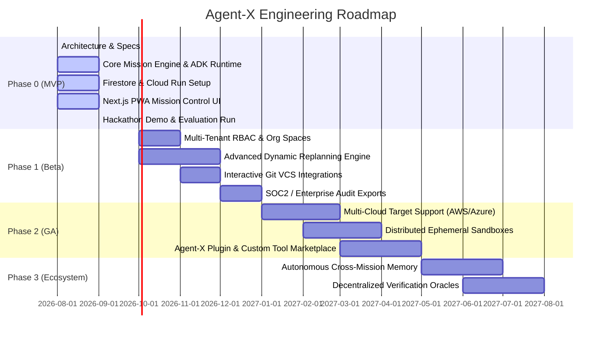

# Agent-X Product Roadmap & Milestones

## 1. Roadmap Phasing Overview

---

## 2. Phase Deliverables & Milestones

### Phase 0: Hackathon & Alpha Launch (Target: Q3 2026)
- **Goal Formulation & DAG Engine**: Gemini 2.5 Pro reasoning to decompose open-ended goals into typed Task DAGs.
- **Google ADK Subagent Runtime**: Role-based subagents (Architect, Coder, Tester, DevOps, Auditor).
- **Core Cloud Infrastructure**: Google Cloud Run, Cloud Pub/Sub, Firestore, Cloud Storage, Secret Manager.
- **Mission Control PWA**: React Flow interactive canvas, streaming telemetry console, and verification inspector.
- **Evidence Protocol**: 4-Level proof hierarchy with GCS artifact persistence and SHA-256 validation.
- **Automated Evaluation Suite**: 20 benchmark scenarios with quantitative scoring.

### Phase 1: Enterprise Beta (Target: Q4 2026)
- **Multi-Tenant Security**: Role-Based Access Control (RBAC), organization workspaces, and Google Workspace SSO integration.
- **Advanced Dynamic Replanning**: Multi-step subtree backtracking and AST-aware code patch synthesis.
- **VCS & Issue Trackers**: Native bidirectional sync with GitHub, GitLab, Jira, and Linear.
- **Compliance & Auditing**: One-click SOC2 / HIPAA-ready audit trail export with immutable cryptographic signatures.

### Phase 2: General Availability (Target: Q1–Q2 2027)
- **Multi-Cloud Target Execution**: Orchestrate deployments and remediation across GCP, AWS, and Azure.
- **Dedicated Remote Sandboxing**: Micro-VM sandboxes (Firecracker / gVisor) for secure execution of arbitrary code and builds.
- **Custom Agent & Tool SDK**: Public plugin ecosystem allowing teams to define custom subagents, domain tools, and verification rules.

### Phase 3: Autonomous Ecosystem (Target: Q3+ 2027)
- **Cross-Mission Epistemic Learning**: Persistent organizational knowledge graph that retains verified architectural patterns and past incident playbooks.
- **Decentralized Verification Oracles**: Cryptographically verified audit certificates registered on public or private ledgers.
