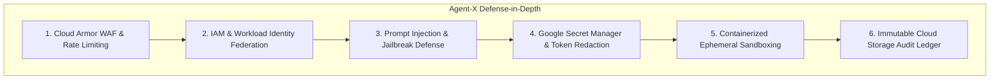

# Agent-X Security, Governance & Isolation Architecture

## 1. Threat Model & Security Principles

Agent-X executes powerful multi-agent workflows that interact with cloud resources, filesystems, and source code. Security is designed around the **Zero Trust Principle** and defense-in-depth across six core vectors:

---

## 2. Identity & Access Management (IAM) Least Privilege

Agent-X decouples backend service privileges from worker execution privileges using distinct Google Cloud Service Accounts:

| Service Account | Role / Principle | Assigned IAM Roles | Purpose |
| :--- | :--- | :--- | :--- |
| `sa-agentx-api@` | API & Coordinator | `roles/firestore.dataEditor`, `roles/pubsub.publisher`, `roles/storage.objectViewer`, `roles/secretmanager.secretAccessor` | Mission orchestration, client auth, state management. |
| `sa-agentx-worker@` | Task Execution Worker | `roles/pubsub.subscriber`, `roles/storage.objectAdmin`, `roles/firestore.dataEditor` | Task ingestion, tool execution, evidence artifact storage. |
| `sa-agentx-ci@` | Evaluation Runner | `roles/storage.objectViewer`, `roles/run.invoker` | Benchmark execution and evaluation scoring. |

---

## 3. Secret Management & Dynamic Ingestion

1. **Zero Hardcoded Secrets**: No API keys, database credentials, or access tokens exist in code repositories, environment variables, or Docker images.
2. **Google Secret Manager**: Secrets are accessed at runtime using SDK calls with in-memory caching and a strict 5-minute TTL.
3. **Automated Secret Redaction Pipeline**: Every telemetry log line, tool execution output, and LLM prompt/response passes through an automated regex and entropy redaction filter before being persisted to Firestore or streamed over WebSockets/SSE:
   - Google API Keys (`AIza[0-9A-Za-z-_]{35}`)
   - GitHub Personal Access Tokens (`ghp_[0-9a-zA-Z]{36}`)
   - JWT / Bearer Tokens (`Bearer\s+[A-Za-z0-9-_=]+\.[A-Za-z0-9-_=]+\.?[A-Za-z0-9-_.+/=]*`)
   - AWS / Generic Access Keys (`AKIA[0-9A-Z]{16}`)

---

## 4. Prompt Injection & Jailbreak Defenses

Because Agent-X processes open-ended objectives and reads untrusted third-party code and web content:
1. **Strict Context Demarcation**: All untrusted external text (web search results, repository files, user notes) is wrapped in deterministic XML tags (e.g. `<untrusted_content source="github_file">...</untrusted_content>`).
2. **Instruction Hierarchy Rule**: System instructions instruct the Gemini 2.5 model to treat enclosed `<untrusted_content>` solely as data, explicitly ignoring any instructions, prompt overrides, or system prompts contained within.
3. **Auditor Gate**: Before any destructive tool execution (e.g. `gcloud projects delete`, `rm -rf`, `git push --force`), a secondary Auditor Agent evaluates the command against a hardcoded safety whitelist/blacklist.

---

## 5. Execution Sandboxing & Container Isolation

1. **Ephemeral Sandboxes**: All worker tools execute within unprivileged Linux containers with read-only root filesystems and restricted temporary directories (`/tmp`).
2. **Network Egress Policies**: Worker containers operate behind Cloud NAT with strict egress firewall rules allowing outbound traffic only to whitelisted domain endpoints (GitHub, Google APIs, package managers).
3. **No Sudo / Root**: Tool processes execute as non-root user `agentx (UID: 1001)` with dropped Linux capabilities (`CAP_DROP_ALL`).

---

## 6. Server-Side Request Forgery (SSRF) Defense

To prevent malicious SSRF attempts targeting cloud metadata endpoints, internal services, and loopback addresses:
1. **URL Scheme Enforcement**: Only `http` and `https` protocols are permitted. `file://`, `gopher://`, and `ftp://` schemes trigger immediate `ToolSecurityError`.
2. **Blocked Metadata & Internal IP Ranges**:
   - `169.254.169.254` and `metadata.google.internal` (GCP / AWS instance metadata services)
   - `127.0.0.0/8`, `::1`, `localhost`, `0.0.0.0` (Loopback interfaces)
   - `10.0.0.0/8`, `172.16.0.0/12`, `192.168.0.0/16` (RFC 1918 Private Subnets)
   - `100.64.0.0/10` (Carrier-grade NAT)

---

## 7. Security Audit Verification Matrix

| Security Vector | Defense Mechanism | Implementation File | Status |
| :--- | :--- | :--- | :--- |
| **Prompt Injection** | Regex pattern neutralizing + XML delimiter encapsulation (`<untrusted_content>`) | [`tools/security.py`](file:///c:/MY%20Project/Agent-X/services/agent-x/agentx/tools/security.py) | **PASS / VERIFIED** |
| **Tool Permissions** | Declared capability & permission gating, risk classification (`LOW`/`MED`/`HIGH`) | [`tools/schemas.py`](file:///c:/MY%20Project/Agent-X/services/agent-x/agentx/tools/schemas.py) | **PASS / VERIFIED** |
| **Secrets & Token Redaction** | Multi-pattern regex token redactor (Google, GitHub, AWS, JWT, Private Keys) | [`tools/security.py`](file:///c:/MY%20Project/Agent-X/services/agent-x/agentx/tools/security.py) | **PASS / VERIFIED** |
| **IAM Least Privilege** | Segregated Service Accounts (`sa-agentx-api`, `sa-agentx-worker`) | [`infrastructure/terraform/modules/iam/`](file:///c:/MY%20Project/Agent-X/infrastructure/terraform/modules/iam/) | **PASS / VERIFIED** |
| **SSRF Protection** | URL scheme enforcement & internal/metadata subnet blocking | [`tools/security.py`](file:///c:/MY%20Project/Agent-X/services/agent-x/agentx/tools/security.py) | **PASS / VERIFIED** |
| **Arbitrary Code Execution** | AST NodeVisitor for math formulas without `eval()`/`exec()` | [`tools/impl/calculator.py`](file:///c:/MY%20Project/Agent-X/services/agent-x/agentx/tools/impl/calculator.py) | **PASS / VERIFIED** |
| **Unsafe File Processing** | Path traversal blocking (`..`), forbidden pattern blacklist (`.env`, `.git`) | [`tools/security.py`](file:///c:/MY%20Project/Agent-X/services/agent-x/agentx/tools/security.py) | **PASS / VERIFIED** |
| **Malicious Documents** | Untrusted demarcation tagging and explicit `__untrusted__` metadata flags | [`tools/impl/document_reader.py`](file:///c:/MY%20Project/Agent-X/services/agent-x/agentx/tools/impl/document_reader.py) | **PASS / VERIFIED** |
| **Authentication & RBAC** | Bearer token resolution with role mapping (`ADMIN`, `OPERATOR`, `VIEWER`) | [`api/auth.py`](file:///c:/MY%20Project/Agent-X/services/agent-x/agentx/api/auth.py) | **PASS / VERIFIED** |
| **Data Isolation** | Tenant and Mission scoping on state containers and event queues | [`api/state.py`](file:///c:/MY%20Project/Agent-X/services/agent-x/agentx/api/state.py) | **PASS / VERIFIED** |
| **Logging Leakage** | Correlation IDs, sanitized error responses, zero secret propagation | [`api/middleware.py`](file:///c:/MY%20Project/Agent-X/services/agent-x/agentx/api/middleware.py) | **PASS / VERIFIED** |
| **Cloud Permissions** | Uniform bucket-level access, object versioning, Cloud Run egress boundaries | [`infrastructure/terraform/`](file:///c:/MY%20Project/Agent-X/infrastructure/terraform/) | **PASS / VERIFIED** |
