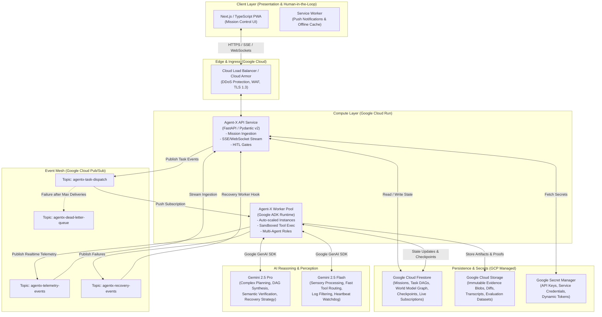
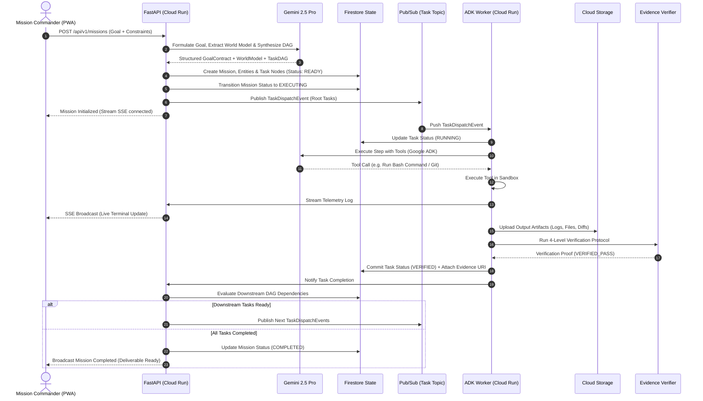

# Agent-X System Architecture

## 1. Architectural Overview & Component Topology

Agent-X is engineered as an event-driven, cloud-native distributed system designed for massive parallelization, resilient state recovery, and sub-second real-time streaming.

---

## 2. Component Specifications

### 2.1 Mission Control PWA (Next.js / TypeScript)
- **Framework**: Next.js (App Router), React 19, Tailwind CSS, Lucide icons, Zustand / TanStack Query for state management.
- **Realtime Integration**: Subscribes directly to Firestore snapshots on client for reactive UI updates and connects to FastAPI Server-Sent Events (SSE) for high-frequency console telemetry logs.
- **PWA Capabilities**: Service Worker for push alerts (e.g. "Mission Paused: HITL Approval Required"), Web App Manifest, IndexedDB caching for offline audit inspection.

### 2.2 API Service (FastAPI / Cloud Run)
- **Role**: Entry point for mission management, client authentication, goal submission, DAG validation, and SSE streaming.
- **Scaling Profile**: Cloud Run with concurrency of 80 requests/instance, min instances 1, max instances 20.
- **Key Responsibilities**:
  - Validates incoming user objectives.
  - Invokes Architect Agent (Gemini 2.5 Pro) to generate initial World Model and Task DAG.
  - Commits mission graph to Firestore.
  - Dispatches unblocked root tasks to Pub/Sub `agentx-task-dispatch`.
  - Bridges internal telemetry events to client SSE streams.

### 2.3 Worker Pool (Google ADK Runtime / Cloud Run)
- **Role**: Ephemeral, event-driven execution units that ingest tasks from Pub/Sub, execute sub-agent logic, run tools, capture evidence, and trigger verification.
- **Scaling Profile**: Cloud Run with concurrency of 1 to 4 tasks/instance (isolated containers), auto-scaling from 0 to 100+ instances based on Pub/Sub backlog.
- **Key Responsibilities**:
  - Deserializes `TaskDispatchEvent`.
  - Instantiates specialized ADK Agent (Coder, Tester, DevOps, Auditor) with role-specific system prompts and tool bindings.
  - Executes tool actions (Git, bash, HTTP, Google Cloud APIs).
  - Captures stdout/stderr, timestamps, network payloads, and output artifacts.
  - Runs Level 1-4 Evidence Verification.
  - Commits task outcomes to Firestore, uploads artifacts to GCS, and publishes telemetry.

### 2.4 Event Mesh (Google Cloud Pub/Sub)
- **`agentx-task-dispatch`**: High-throughput topic for unblocked DAG tasks. Configured with an Ack Deadline of 300s, exponential retry policy, and a Dead Letter Queue (`agentx-dead-letter-queue`) after 5 failed deliveries.
- **`agentx-telemetry-events`**: Lightweight event stream for agent reasoning thoughts, tool calls, and real-time logs.
- **`agentx-recovery-events`**: Publishes failed task events to trigger root-cause analysis and dynamic DAG replanning.

### 2.5 State and Persistence (Firestore & Cloud Storage)
- **Google Cloud Firestore (Native Mode)**: Strongly consistent document database. Stores missions, DAG task nodes, World Model entity graphs, execution checkpoints, and audit logs. Enables real-time document listeners for instant UI synchronization.
- **Google Cloud Storage (GCS)**: Multi-region immutable object store (`gs://agentx-evidence-artifacts-{env}`). Holds raw tool logs, screenshots, code patches, build artifacts, test coverage reports, and evaluation trajectory logs.

### 2.6 AI Reasoning (Gemini 2.5 via Google Gen AI SDK)
- **Dual-Model Strategy**:
  - **Gemini 2.5 Pro**: High-complexity cognitive reasoning (Goal deconstruction, DAG synthesis, code generation, root-cause diagnosis, semantic verification).
  - **Gemini 2.5 Flash**: High-speed, cost-effective operations (Telemetry filtering, tool parameter extraction, heartbeat checks, classification).

---

## 3. End-to-End Mission Execution Flow

