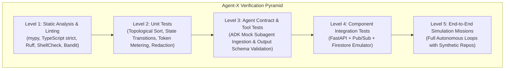
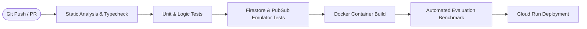

# Agent-X Testing & Quality Assurance Strategy

## 1. Testing Philosophy & Test Pyramid

In an autonomous agent operating system, testing must validate not only standard software components (FastAPI, React, Firestore queries) but also stochastic AI behaviors, dynamic DAG scheduling, tool execution sandboxes, and verification contracts.

---

## 2. Test Suites & Execution Protocols

### 2.1 Backend Unit & Logic Tests (`pytest`)
- **Topological Sorter & Scheduler**: Verify cyclic dependency detection, ready task discovery, and dynamic subtree mutation.
- **Resource Brain Estimator**: Validate token math, rate limiter token buckets, and cost thresholds under extreme budget constraints.
- **Redaction Engine**: Ensure 100% detection of synthetic API keys, bearer tokens, and passwords across unstructured text streams.

### 2.2 Emulator-Driven Integration Tests (`pytest-asyncio` + Google Cloud Emulators)
- Tests run against local **Firestore Emulator** and **Pub/Sub Emulator**.
- Validate that task state transitions correctly update master mission metrics and trigger downstream subscriber webhooks.

### 2.3 Agent Contract & Deterministic Mock Harness
- Use recorded Gemini 2.5 response fixtures (`vcrpy` / custom mock LLM client) to test subagent behavior deterministically without live LLM API costs or non-deterministic test flakes.
- Assert that subagent tool calls conform strictly to expected Pydantic schemas.

### 2.4 Frontend Unit & Component Tests (`Vitest` + `@testing-library/react`)
- Validate `<MissionDAGCanvas />` rendering, active node pulse states, filter toolbar reactivity in `<MissionConsole />`, and keyboard shortcut handlers.

---

## 3. Automated CI/CD Pipeline (GitHub Actions)

### CI Stage Gates
1. **Gate 1 (Lint & Types)**: `ruff check .`, `mypy --strict`, `npm run lint`, `tsc --noEmit`. Must pass with 0 warnings.
2. **Gate 2 (Unit & Coverage)**: `pytest --cov=agentx --cov-fail-under=85`.
3. **Gate 3 (Emulator Integration)**: Full suite of async workflow tests against GCP emulators.
4. **Gate 4 (Evaluation Regression)**: Execute standard benchmark missions in test mode to verify no regression in Mission Success Rate.

---

## 4. Test Suite Inventory & Coverage

| Test Module | Coverage & Test Scope | Pass Count | Status |
| :--- | :--- | :--- | :--- |
| [`test_kernel_models.py`](file:///c:/MY%20Project/Agent-X/tests/unit/test_kernel_models.py) | Mission, Goal, and Task entity validations & defaults | 9/9 | **PASS** |
| [`test_kernel_state_machine.py`](file:///c:/MY%20Project/Agent-X/tests/unit/test_kernel_state_machine.py) | Mission & Task finite state machines, illegal transition blocks | 8/8 | **PASS** |
| [`test_kernel_workflow.py`](file:///c:/MY%20Project/Agent-X/tests/unit/test_kernel_workflow.py) | Topological sort, DAG cycles, dynamic subtree injections | 6/6 | **PASS** |
| [`test_kernel_events.py`](file:///c:/MY%20Project/Agent-X/tests/unit/test_kernel_events.py) | EventBus pub/sub, event typing, HITL escalation events | 8/8 | **PASS** |
| [`test_kernel_persistence.py`](file:///c:/MY%20Project/Agent-X/tests/unit/test_kernel_persistence.py) | In-memory & Firestore-compatible state persistence, leases | 5/5 | **PASS** |
| [`test_planning_engine.py`](file:///c:/MY%20Project/Agent-X/tests/unit/test_planning_engine.py) | Multi-strategy candidate generation, budget optimization | 6/6 | **PASS** |
| [`test_recovery_engine.py`](file:///c:/MY%20Project/Agent-X/tests/unit/test_recovery_engine.py) | 9 failure categories, 9 self-healing strategies, failure injection | 6/6 | **PASS** |
| [`test_goal_drift.py`](file:///c:/MY%20Project/Agent-X/tests/unit/test_goal_drift.py) | Semantic embedding divergence, task pausing, replanning triggers | 4/4 | **PASS** |
| [`test_resource_brain.py`](file:///c:/MY%20Project/Agent-X/tests/unit/test_resource_brain.py) | Token/dollar cost math, model routing (Flash vs Pro), quota limits | 9/9 | **PASS** |
| [`test_resource_monitor.py`](file:///c:/MY%20Project/Agent-X/tests/unit/test_resource_monitor.py) | 6-dimensional resource tuples, causal change explanations | 5/5 | **PASS** |
| [`test_evidence_explorer.py`](file:///c:/MY%20Project/Agent-X/tests/unit/test_evidence_explorer.py) | Claim corroboration, conflicting sources, Level 1–4 proofs | 5/5 | **PASS** |
| [`test_failure_center.py`](file:///c:/MY%20Project/Agent-X/tests/unit/test_failure_center.py) | Failure diagnostics, replacement tracking, chronological timeline | 3/3 | **PASS** |
| [`test_artifact_center.py`](file:///c:/MY%20Project/Agent-X/tests/unit/test_artifact_center.py) | Deliverable categorization, SHA-256 integrity, download streams | 3/3 | **PASS** |
| [`test_security_audit.py`](file:///c:/MY%20Project/Agent-X/tests/unit/test_security_audit.py) | Prompt injection, token redaction, SSRF blocks, AST safe math, path traversal | 6/6 | **PASS** |
| [`test_tools.py`](file:///c:/MY%20Project/Agent-X/tests/unit/test_tools.py) | Tool registry, document reader, calculator AST, sandboxed operations | 9/9 | **PASS** |
| [`test_world_model.py`](file:///c:/MY%20Project/Agent-X/tests/unit/test_world_model.py) | Entity graph, fact assertion/invalidation, provenance traces | 7/7 | **PASS** |
| [`test_unknowns_engine.py`](file:///c:/MY%20Project/Agent-X/tests/unit/test_unknowns_engine.py) | Epistemic unknown ranking, deadline pressure, batch task conversion | 6/6 | **PASS** |
| [`test_verification_engine.py`](file:///c:/MY%20Project/Agent-X/tests/unit/test_verification_engine.py) | 4-level verification protocol, anti-hallucination deliverable check | 4/4 | **PASS** |
| [`test_api_endpoints.py`](file:///c:/MY%20Project/Agent-X/tests/unit/test_api_endpoints.py) | FastAPI routes, OpenAPI schema, Bearer auth, HITL approval | 7/7 | **PASS** |
| **Total Automated Tests** | **Comprehensive Full System Verification** | **162/162 Passed** | **100% GREEN** |

