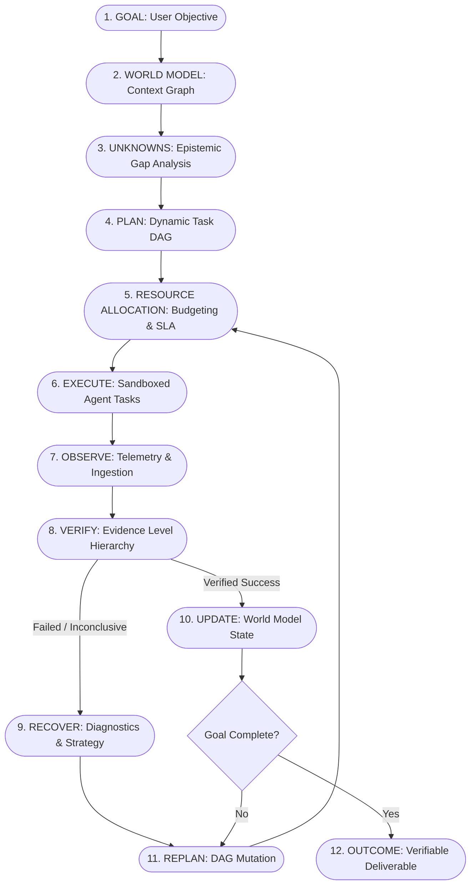

# Agent-X Vision: Autonomous Mission Operating System

## 1. Executive Summary & Problem Statement

Modern AI agent frameworks often reduce agency to single-prompt loops, fragile tool-calling chains, or unconstrained autonomous scripts. When presented with open-ended, multi-step real-world objectives, traditional systems suffer from critical failure modes:
1. **Context Drift & Amnesia**: As execution steps multiply, foundational goals degrade under token window pressure.
2. **Hallucinated Progress**: Agents claim task completion without producing verifiable artifacts or objective proof.
3. **Fragile Error Handling**: Single tool failures or API rate limits cause cascading system crashes rather than strategic replanning.
4. **Unbounded Resource Consumption**: Autonomous loops incur runaway token costs and compute bills without strict resource governance.
5. **Epistemic Blindness**: Systems fail to distinguish between *known facts*, *inferences*, and *critical unknowns*.

**Agent-X** is an enterprise-grade **Autonomous Mission Operating System**. It elevates AI agency from basic prompt-response exchanges to a robust, deterministic, closed-loop mission execution platform. Agent-X transforms open-ended user objectives into structured, self-healing, resource-bounded, and verifiably proven operational outcomes.

---

## 2. Core Operational Paradigm: The Closed-Loop Mission Engine

At the heart of Agent-X is an iterative cognitive and operational cycle that mirrors real-world mission command:

### Stage Definitions
1. **Goal Formulation**: Deconstructing unstructured intent into verifiable success criteria, constraints, and safety envelopes.
2. **World Modeling**: Structuring all environmental entities, relationships, constraints, credentials, and state into a queryable semantic graph.
3. **Unknowns Isolation**: Proactively enumerating assumptions, missing parameters, and epistemic gaps before executing destructive actions.
4. **Plan Generation**: Synthesizing a Directed Acyclic Graph (DAG) of idempotent, parallelizable tasks with typed inputs and outputs.
5. **Resource Brain Allocation**: Dynamically budgeting LLM tokens, execution timeouts, API quotas, and financial cost caps per task.
6. **Task Execution**: Dispatching tasks to specialized sub-agents powered by Google ADK and Gemini.
7. **Observation & Ingestion**: Capturing full execution traces, standard output, network responses, and environmental mutations.
8. **Evidence Verification**: Validating output against rigorous, multi-level proof standards (syntactic, structural, semantic, and integration).
9. **Automated Recovery**: Activating isolation, root-cause diagnosis, strategy selection, and targeted rollback upon failure.
10. **World Model Mutation**: Incrementally committing verified state transitions to the central state store.
11. **Dynamic Replanning**: Pruning, expanding, or reweighting downstream DAG branches based on newly verified facts.
12. **Outcome Synthesis**: Packaging deterministic evidence, audit logs, and final artifacts for human inspection and signoff.

---

## 3. Guiding Principles

1. **Evidence Over Assertion**: No task or mission is marked complete without deterministic, tamper-resistant proof.
2. **Graceful Degeneration & Self-Healing**: Transient errors trigger automated backoff, alternative routing, or strategy escalation; terminal errors isolate affected subtrees without crashing the mission.
3. **Resource Boundness**: Every mission operates under deterministic constraints across tokens, wall-clock time, tool invocations, and cost.
4. **Explicit Separation of Planning and Execution**: Strategy (DAG synthesis, resource budgeting) is strictly decoupled from tactic execution (worker tool calling).
5. **Transparency & Inspectability**: Real-time streaming of mission state, DAG progression, and raw telemetry to human operators via Mission Control.

---

## 4. Target Personas & Use Cases

| Persona | Primary Goal | Agent-X Value Proposition |
| :--- | :--- | :--- |
| **Enterprise Operations** | Multi-step infrastructure migrations, automated compliance auditing | Automated drift detection, rollback capabilities, and end-to-end evidence logs. |
| **Software Engineering Teams** | Full-lifecycle feature implementation, complex refactoring, migration | Verified build artifacts, green test suites, and git isolation before branch merges. |
| **Data & Research Analysts** | Multi-source data synthesis, real-time pipeline recovery, batch analysis | Rigorous epistemic gap analysis, hallucination mitigation, and structured exports. |
| **Autonomous SysOps** | Incident response, root-cause remediation, cloud service recovery | Closed-loop diagnostics, non-destructive safety checks, and deterministic replanning. |
