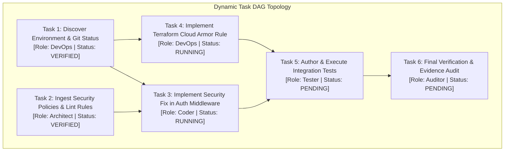
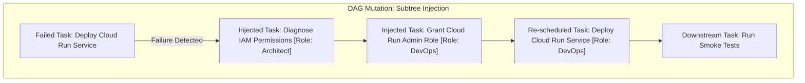

# Agent-X Workflow Engine & Dynamic Task DAG

## 1. Workflow Architecture & DAG Model

The **Agent-X Workflow Engine** manages the synthesis, topological scheduling, distributed dispatch, and live mutation of the mission's Directed Acyclic Graph (DAG). Every mission is executed as a series of strictly typed, dependency-resolved task nodes.



---

## 2. Task DAG Data Model & Node Schema

Every task node is stored in Firestore under `/missions/{missionId}/tasks/{taskId}`.

```python
from pydantic import BaseModel, Field
from typing import List, Dict, Any, Optional
from enum import Enum
import datetime


class TaskStatus(str, Enum):
    PENDING = "PENDING"
    READY = "READY"
    DISPATCHED = "DISPATCHED"
    RUNNING = "RUNNING"
    VERIFYING = "VERIFYING"
    VERIFIED = "VERIFIED"
    FAILED = "FAILED"
    SKIPPED = "SKIPPED"
    PAUSED = "PAUSED"


class TaskNode(BaseModel):
    task_id: str = Field(..., description="Unique deterministic task ID (e.g. 'task-01')")
    mission_id: str
    name: str
    description: str
    agent_role: str
    status: TaskStatus = TaskStatus.PENDING
    dependencies: List[str] = Field(
        default_factory=list, description="List of prerequisite task_ids"
    )
    dependent_children: List[str] = Field(default_factory=list, description="Downstream task_ids")
    inputs: Dict[str, Any] = Field(default_factory=dict)
    outputs: Dict[str, Any] = Field(default_factory=dict)
    expected_outputs: List[str] = Field(default_factory=list)
    idempotency_key: str = Field(
        ..., description="Hash of task inputs and role to prevent duplicate runs"
    )
    retry_count: int = 0
    max_retries: int = 3
    timeout_seconds: int = 300
    allocated_tokens: int = 50000
    evidence_uri: Optional[str] = None
    error_message: Optional[str] = None
    started_at: Optional[datetime.datetime] = None
    completed_at: Optional[datetime.datetime] = None
```

---

## 3. Dynamic Parallelism & Topological Scheduling

1. **Dependency Resolution**: A task transitions from `PENDING` to `READY` when all tasks in its `dependencies` array reach the `VERIFIED` status.
2. **Parallel Dispatching**: As soon as multiple tasks achieve `READY` status concurrently, the Coordinator publishes individual `TaskDispatchEvent` payloads to the Pub/Sub topic `agentx-task-dispatch`.
3. **Worker Concurrency**: Cloud Run worker instances independently pull and execute ready tasks in parallel, maximizing throughput across independent execution branches.
4. **Idempotency Enforcement**: If a duplicate task dispatch message is delivered, the worker checks Firestore for an active execution lock or verified result matching the `idempotency_key`. If already verified, the worker acknowledges the message immediately without re-execution.

---

## 4. Live DAG Mutation & Dynamic Replanning

When a task fails or an exploratory step discovers unexpected environmental state, the Workflow Engine performs **live DAG surgery**:



### Mutation Protocol
1. **Freeze Subtree**: Mark all direct and indirect downstream dependents of the failing node as `PAUSED`.
2. **Synthesize Injected Tasks**: The Coordinator and Architect Agent generate a repair sub-graph with explicit dependencies.
3. **Atomic Batch Commit**: Firestore writes the new repair nodes and updates dependent edges within a single Firestore batched write.
4. **Resume Dispatch**: Once the injected sub-graph verifies successfully, the downstream tasks are unlocked and scheduled.
