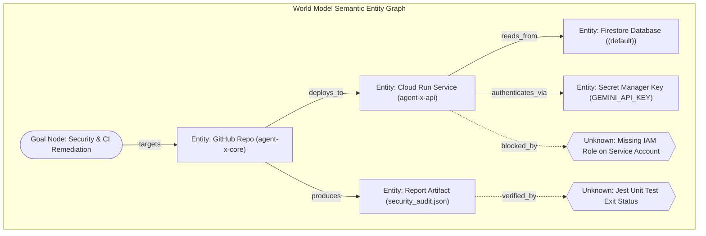

# Agent-X World Model & Epistemic State Engine

## 1. Concept & Purpose

In complex, open-ended missions, an AI system cannot rely on raw chat history to maintain environmental truth. The **Agent-X World Model** is a deterministic, structured semantic graph representing the current known state of the operating environment, target systems, artifacts, credentials, constraints, and epistemic gaps.



---

## 2. Epistemic Classification: Knowns vs Assumptions vs Unknowns

Agent-X categorizes all domain information into three strictly enforced epistemic states:

| Epistemic State | Definition | Verification Requirement | Allowable Actions |
| :--- | :--- | :--- | :--- |
| **`KNOWN_FACT`** | An empirically observed, verified property of the environment (e.g. file exists, endpoint returns 200). | Must link to an immutable Evidence URI in GCS. | Can be used as immutable input to destructive or downstream tasks. |
| **`INFERRED_ASSUMPTION`** | A working hypothesis generated by LLM reasoning (e.g. "repository likely uses Node 20 based on package.json"). | Tagged with confidence score $[0.0, 1.0]$. | Allowed for exploratory planning, but forbidden for irreversible mutations without verification. |
| **`CRITICAL_UNKNOWN`** | A required parameter or dependency whose state is completely unobserved (e.g. missing API key, uninspected test suite). | Zero evidence available; flagged during goal formulation. | Triggers automatic generation of exploratory/discovery DAG tasks. |

---

## 3. World Model Entity & Edge Schema

### 3.1 Entity Node Definition
```python
from pydantic import BaseModel, Field
from typing import Dict, Any, List, Optional
from enum import Enum
import datetime


class EntityType(str, Enum):
    REPOSITORY = "REPOSITORY"
    SOURCE_FILE = "SOURCE_FILE"
    CLOUD_SERVICE = "CLOUD_SERVICE"
    DATABASE_RESOURCE = "DATABASE_RESOURCE"
    SECRET_POINTER = "SECRET_POINTER"
    TEST_SUITE = "TEST_SUITE"
    ARTIFACT = "ARTIFACT"
    EPISTEMIC_UNKNOWN = "EPISTEMIC_UNKNOWN"


class EpistemicState(str, Enum):
    KNOWN_FACT = "KNOWN_FACT"
    INFERRED_ASSUMPTION = "INFERRED_ASSUMPTION"
    CRITICAL_UNKNOWN = "CRITICAL_UNKNOWN"


class WorldModelEntity(BaseModel):
    entity_id: str = Field(..., description="Unique entity identifier (e.g. 'repo:agent-x-core')")
    mission_id: str
    entity_type: EntityType
    name: str
    properties: Dict[str, Any] = Field(default_factory=dict)
    epistemic_state: EpistemicState
    confidence: float = Field(default=1.0, ge=0.0, le=1.0)
    evidence_uri: Optional[str] = Field(default=None, description="GCS URI proving entity state")
    created_at: datetime.datetime = Field(default_factory=datetime.datetime.utcnow)
    updated_at: datetime.datetime = Field(default_factory=datetime.datetime.utcnow)
    created_by_task_id: Optional[str] = None
```

### 3.2 Edge Relationship Definition
```python
class RelationshipType(str, Enum):
    DEPENDS_ON = "DEPENDS_ON"
    MUTATES = "MUTATES"
    READS_FROM = "READS_FROM"
    AUTHENTICATES_VIA = "AUTHENTICATES_VIA"
    PRODUCES = "PRODUCES"
    BLOCKED_BY_UNKNOWN = "BLOCKED_BY_UNKNOWN"
    VERIFIES = "VERIFIES"


class WorldModelEdge(BaseModel):
    edge_id: str
    mission_id: str
    source_entity_id: str
    target_entity_id: str
    relationship: RelationshipType
    metadata: Dict[str, Any] = Field(default_factory=dict)
```

---

## 4. State Mutation & Consistency Protocol

1. **Transactional Entity Writes**: World model entities are persisted in Firestore under `/missions/{missionId}/entities/{entityId}` and edges under `/missions/{missionId}/edges/{edgeId}`.
2. **Deterministic Mutation Ledger**: Whenever a subagent task executes a tool that modifies the environment (e.g. creates a file, updates a Cloud Run service), it must output an `EntityMutationEvent`.
3. **Atomic Transition from Unknown to Known**: When an exploratory task resolves an epistemic unknown, the `CRITICAL_UNKNOWN` node is transitioned to `KNOWN_FACT`, the blocking edge is removed from the DAG, and dependent downstream tasks are unlocked.
